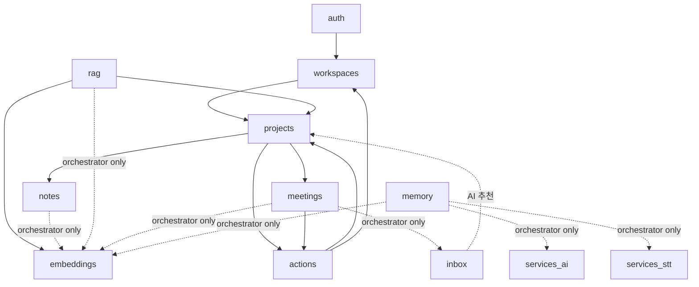

<!-- Kairos 도메인 헌법 — 도메인 경계, 핵심 불변식, per-context 색인 -->

# Kairos CONTEXT-MAP

> 이 문서는 프로젝트의 **헌법**이다. 모든 코드/문서/명명은 여기에 우선한다. 충돌 시 즉시 멈추고 헌법을 정렬한다.
>
> 워크플로우 Stage 0 산출물 (`.ai/templates/workflow.md`).
> 도메인별 상세는 각 모듈의 `CONTEXT.md` 참조 (§5 색인).

---

## 1. 한 문장 정의

**Kairos는 팀의 세컨드 브레인이다.** 회의·노트·자료를 Capture하면 AI가 자동으로 Organize·Distill하고, RAG로 Express(검색·인사이트)한다. 핵심 차별점은 Distill의 자동화.

### Distill 도메인 매핑

| Level | 의미 | 책임 도메인 |
|---|---|---|
| L0 | 원본 (음성, 자료 파일, 노트 텍스트) | upload, meetings, notes |
| L1 | 트랜스크립트 + 요약 | meetings (TranscriptSegment, MeetingSummary) |
| L2 | 결정사항 + 액션 아이템 | meetings (key_decisions), actions (ActionItem) |
| L3 | 프로젝트 인사이트 (주간/월간) | projects (현재 부분 구현) |
| L4 | 조직 인사이트 (크로스 프로젝트) | (미구현 — Phase 4, ADR-007) |

---

## 2. 핵심 엔티티 (18개)

> ERD 원본: `docs/architecture/erd.md`. 본 문서가 코드 사실 기준 — ERD와 충돌 시 본 문서 우선.

| 엔티티 | 소유 도메인 | 정의 | 식별 |
|---|---|---|---|
| **Workspace** | workspaces | 멀티테넌시 격리 단위. 모든 콘텐츠의 루트. `type`: `personal` / `team` (Sprint 15 신설) | UUID, `inbox_threshold: float = 0.9` 보유 |
| **WorkspaceMember** | workspaces | role: `owner` / `admin` / `member` / `viewer` | (workspace_id, user_id) 유일 |
| **WorkspaceInvite** | workspaces | 초대 링크 (nanoid 12자리 code + role + max_uses + expires_at) | code 유일 |
| **Project** | projects | 작업 단위 (PARA Replace). status: `active` / `completed` / `archived` | workspace 내 |
| **InboxItem** | inbox | 콘텐츠의 1차 진입점 | source_type + source_id |
| **Meeting** | meetings | 회의 음성 + 처리 결과. status: `uploading` / `transcribing` / `analyzing` / `completed` / `failed` | workspace 범위 |
| **TranscriptSegment** | meetings | 화자별 문장 (시간 구간). `speaker` 기본값 `"Speaker"` (Sprint 1 화자 분리 없음) | (meeting_id, start_sec) |
| **MeetingSummary** | meetings | 회의당 1:1 AI 요약 | meeting_id 유일 |
| **MeetingProjectLink** | projects | Meeting↔Project N:M | (meeting_id, project_id) 유일 |
| **ActionItem** | actions | status: `todo` / `in_progress` / `done` / `cancelled`. `project_id` / `meeting_id` / `assignee_id` / `due_date` 모두 **nullable** | workspace 범위 |
| **Note** | notes | Tiptap JSON 콘텐츠 (Project 종속) | project 내 |
| **MemoryItem** | memory | Recall-first wedge. `type`: `text` / `voice`. status: `processing` / `transcription_pending` / `embedding_pending` / `embedding_failed` / `active` / `archived`. `r2_audio_key` (voice, 30일 TTL) + `distilled_json` (Gemini 출력) | (workspace_id, id). Sprint 15 신설 |
| **PromoteAudit** | memory | Promote (복제 + tombstone) 감사 row. `memory_id` (source) + `target_workspace_id` + `new_memory_id` + `promoted_by_user_id`. **I-18 강제** | (memory_id, new_memory_id). Sprint 15 신설 |
| **MemoryAiCall** | memory | distill / embedding / transcribe 호출 cost+latency 로그. `model_id` + `tokens_in/out` + `cost_usd` + `elapsed_ms` | memory_id 범위. Sprint 15 신설 |
| **MemoryQueryEmbeddingCache** | memory | Recall query 임베딩 캐시 (C3 fix). normalized_query + workspace_id 복합 키 | (workspace_id, normalized_query). Sprint 15 신설 |
| **MemoryEvent** | memory | R7 metrics 원천 (capture / recall / promote count + recall latency). Cloud Run stateless 정합. memory_id 가 nullable (recall 이벤트는 memory FK 없음) | (workspace_id, event_type, created_at). Sprint 15 신설 |
| **EmbeddingChunk** | embeddings | 1536d **halfvec** 벡터 (Sprint 16 ADR-020 — fp16, 4B→2B) + 계층 (L1/L2 사용, L0 미사용). MemoryItem도 source_type=`memory`로 적재 | source_type + source_id + chunk_index |
| **SemanticCache** | embeddings | TTL 7일, 유사도 ≥0.93 히트. 1536d **halfvec** 벡터 (Sprint 16 ADR-020). RAG는 호출자(read/write) | PK `id`. 의미적 식별 (workspace_id, project_id, question_embedding) — DB unique constraint 없음 |
| **User** | auth | Clerk 인증 외부 ID 매핑 | clerk_id 유일 |

### 별칭 금지 (도메인 용어 위반 감지 대상)

| 정식 용어 | 사용 금지 별칭 |
|---|---|
| Workspace | Team, Tenant, Org, Organization |
| WorkspaceMember | User-Role, Membership, Participant |
| Project | Area, Folder, Category, PARA Area |
| InboxItem | Note (Note는 Tiptap 노트 전용), Capture, Item |
| Meeting | Recording, Session, Audio |
| TranscriptSegment | Sentence, Caption, Subtitle, Line |
| MeetingSummary | Summary (단독 — 항상 Meeting 접두) |
| ActionItem | Task, Todo, Issue |
| Note | Memo, Doc, Document |
| MemoryItem | Memory (단수 단독 금지), Capture (Capture는 동사), QuickNote, Snippet |
| PromoteAudit | Promotion Log, AuditLog (단독 금지) |
| MemoryAiCall | AI Log, Distill Log |
| MemoryQueryEmbeddingCache | Query Cache (SemanticCache와 충돌), Recall Cache |
| MemoryEvent | Memory Log, Activity Log |
| EmbeddingChunk | Vector, Embedding (단수형 금지 — 계층 강조) |
| SemanticCache | Query Cache, RAG Cache, Answer Cache |
| User | Account, Member (Member는 WorkspaceMember 전용) |

---

## 3. CODE 메서드 — 가치 흐름

> 원본: `docs/requirements/second-brain.md`

```
[Capture]   회의 녹음 / 노트 / 자료 → InboxItem
   ↓
[Organize]  AI: 프로젝트 자동 연결 + 태그
   ↓
[Distill]   AI Distillation L0~L4 (§1 매핑 참조)
   ↓
[Express]   RAG 6-Layer 검색 + Q&A (스트리밍 SSE) + 프로액티브 인사이트
```

**현재 구현 위치**: L0~L2 완성. L3는 부분, L4는 Phase 4 예정 (ADR-007).

---

## 4. 도메인 경계

### 4.1 백엔드 도메인 모듈 (13개)

```
backend/src/
├── auth/          Clerk JWT 검증 (User 매핑)
├── workspaces/    Workspace (type=personal/team) + WorkspaceMember + WorkspaceInvite + inbox_threshold
├── projects/      Project CRUD + MeetingProjectLink + 태그
├── inbox/         Inbox 적재 + AI 분류 추천
├── meetings/      Meeting 인제스트, STT, 파이프라인
├── notes/         Tiptap Note
├── actions/       ActionItem (nullable project/meeting/assignee)
├── memory/        Sprint 15 Recall-first wedge — MemoryItem capture (text+voice) / Distill / Recall (vector+keyword fallback) / Promote (복제+tombstone, I-18). service.py가 orchestrator 역할 (BL-005/BL-006로 pipeline_service.py 분리 등재됨)
├── upload/        Cloudflare R2 업로드 (presigned URL)
├── embeddings/    EmbeddingChunk + SemanticCache 저장/검색 (pgvector). source_type 추가: `memory`
├── rag/           RAG 6-Layer + Gemini 답변 (SSE 스트리밍)
├── common/        database / r2 / pagination / exceptions / prompts
├── core/          config (pydantic-settings)
└── services/      외부 API wrapper (transcription, ai_processing)
```

각 도메인 폴더 표준 구성: `router.py` / `service.py` / `repository.py` / `schemas.py` / `models.py` / `dependencies.py` / `exceptions.py`

### 4.2 의존 방향 (허용/금지)



| 케이스 | 허용 | 강제 위치 |
|---|---|---|
| `inbox → projects.repository` (AI 추천 후보 조회) | ✅ Repository 레벨까지 | inbox/service.py:현존 |
| `meetings → actions.repository` (액션 저장) | ✅ Repository 레벨까지 | meetings/service.py:현존 |
| `actions → projects.repository`, `actions → workspaces.repository` | ✅ Repository 레벨까지 | actions/service.py:현존 |
| `embeddings.service` 호출 (cross-domain shared service) | ✅ orchestrator(`*/pipeline_service.py` 또는 `services/`) 내부에서만 (ADR-014) | code review |
| 도메인 service.py 끼리 직접 호출 (Repository 우회) | ❌ 금지 | code review |
| 크로스 도메인 트랜잭션 (3개 이상 모듈 + commit) | ❌ orchestrator 필수 | `<domain>/pipeline_service.py` 또는 `services/` |

> **헌법 결정 #1**: Repository는 다른 도메인에서 직접 의존해도 OK (read-only 조회 한정). Service-to-Service는 오케스트레이터 경유 필수. **embeddings·ai_processing·transcription은 cross-domain shared service**로 분류 — 직접 호출은 orchestrator 경계(`*/pipeline_service.py` 또는 `services/`) 내부에서만 허용 (ADR-014).

### 4.3 프론트엔드 features (FSD)

```
frontend/src/features/  — 실제 11개
├── inbox/        InboxItem CRUD + 분류 다이얼로그
├── projects/     Project CRUD + 디테일
├── meetings/     Meeting 업로드 + 디테일 + 트랜스크립트
├── actions/      ActionItem 보드
├── notes/        Tiptap Note CRUD + TiptapEditor (note-editor.tsx)
├── rag/          RAG 검색 + Q&A (SSE)
├── members/      워크스페이스 멤버 + 초대
├── workspaces/   워크스페이스 스위처
├── upload/       업로드 드롭존
├── sources/      소스(자료) 목록
└── home/         대시보드 위젯
```

shadcn `components/ui/`는 수정 금지 (DESIGN.md §토큰 규칙).

> **TiptapEditor는 별도 feature 폴더가 아니다.** `frontend/src/features/notes/components/note-editor.tsx`에 위치.

---

## 5. per-context CONTEXT.md 색인

| 경로 | 범위 |
|---|---|
| `frontend/CONTEXT.md` | Next.js 16 + RSC + FSD + 시안→컴포넌트 흐름 |
| `backend/CONTEXT.md` | FastAPI 전역 (Router/Service/Repo, AsyncSession, BackgroundTasks, SSE, prompts) |
| `backend/src/meetings/CONTEXT.md` | STT + 화자 분리 + 요약 파이프라인 |
| `backend/src/inbox/CONTEXT.md` | AI 자동 확정 vs 사용자 조정 |
| `backend/src/rag/CONTEXT.md` | RAG 6-Layer + SSE 스트리밍 |
| `backend/src/projects/CONTEXT.md` | 인사이트 L1~L4 + 멤버십 (Sprint 6 예정) |
| `backend/src/actions/CONTEXT.md` | 액션 추출/추적 (nullable 부모) |
| `backend/src/memory/CONTEXT.md` | Recall-first wedge — Capture(text+voice)/Distill/Recall/Promote. service.py가 orchestrator 역할 (BL-005/BL-006 refactor 대기) |
| 그 외 (auth, embeddings, notes, upload, workspaces) | `backend/CONTEXT.md` 안 짧은 섹션 |

---

## 6. 핵심 불변식 (위반 시 즉시 중단)

> 코드/문서로 검증된 사실. 별도 증빙 없이 어겨선 안 됨.

| # | 불변식 | 강제 위치 |
|---|---|---|
| I-1 | **AsyncSession은 Repository만 보유** — Service에 `from sqlalchemy.ext.asyncio import AsyncSession` 금지 | `backend/src/<domain>/service.py` |
| I-2 | **크로스 도메인 트랜잭션은 orchestrator 경유** — 같은 session 공유, 마지막 1회 commit 원칙. **예외: 장기 파이프라인 진행 보고용 status commit 허용** — BackgroundTask에서 클라이언트 polling을 지원하려면 status 전이마다 commit이 필요. 이 경우 부분 커밋 상태 모델이 생성됨: `transcribing`(세그먼트 없음) / `analyzing`(세그먼트 있음) / `completed`(요약+임베딩 있음) / `failed`(error_message 있음). | `<domain>/pipeline_service.py` 또는 `services/` |
| I-3 | **AI 모델 고정**: Gemini `gemini-2.5-flash` | `core/config.py` |
| I-4 | **프롬프트 중앙 관리**: `common/prompts.py` 상수만, 인라인 프롬프트 금지 | code review |
| I-5 | **장기 작업**: `BackgroundTasks` + `202 Accepted` + `GET .../status` polling | meetings 패턴 |
| I-6 | **임베딩 모델 고정**: OpenAI `text-embedding-3-small`, 1536d | `embeddings/service.py` |
| I-7 | **임베딩 검색 대상은 chunk_level = 2 만**. L0(document)은 코드 미사용, L1은 부모 참조용 | `embeddings/repository.py` |
| I-8 | **SemanticCache TTL 7일, threshold 0.93** | `embeddings/` (rag는 호출자) |
| I-9 | **멀티테넌시 격리**: 모든 Repository는 `workspace_id` 필터 강제. 신규 EmbeddingChunk insert 시 `workspace_id`는 신규 entity owner workspace와 매칭 (service layer 검증 + `embeddings/service.py:create_chunk` 진입 assertion). | `<domain>/repository.py` `.where(... .workspace_id == workspace_id)`, `backend/src/embeddings/service.py:create_chunk` |
| I-10 | **Inbox confidence 임계값**: 워크스페이스별 `workspaces.inbox_threshold` (기본 0.9). PATCH 가능 | `workspaces/models.py:15`, `meetings/pipeline_service.py:67` |
| I-11 | **shadcn `components/ui/` 수정 금지** | `frontend/src/components/ui/` |
| I-12 | **언어 정책**: 사고/문서/주석 한국어, 코드/네이밍 영어 | AGENTS.md §1 |
| I-13 | **API workspace prefix 강제**: `/api/v1/workspaces/{workspace_id}/<resource>` (단 `auth`는 예외 — `/api/v1/users`) | `<domain>/router.py` |
| I-14 | **Pydantic V2 + 100% async**: `session.exec()` 금지, `.dict()` 대신 `.model_dump()`, `BaseSettings`는 `pydantic_settings`에서 import | code review |
| I-15 | **Secret은 `SecretStr`**: 사용 시 `.get_secret_value()` | `core/config.py` |
| I-16 | **DB snake_case ↔ API camelCase**: Pydantic alias로 변환 | `<domain>/schemas.py` |
| I-17 | **cross-workspace ProjectMember 추가 차단 = ProjectService 책임**: `ProjectService.add_member`는 반드시 `WorkspaceRepository.find_member(workspace_id, user_id)`를 호출하여 대상 user가 동일 워크스페이스 멤버임을 검증한다. None이면 `CrossWorkspaceMemberError(403)`. I-9(Repository read 필터)와 레이어 분리: I-9는 read 필터, I-17은 write 검증. | `backend/src/projects/service.py:add_member` |
| I-18 | **Promotion은 항상 복제 + tombstone, 이동 금지** (Sprint 15 ADR-016 AD-41 + ADR-016 reframe note). `MemoryService.promote`는 source MemoryItem을 보존하고 target workspace에 새 MemoryItem 행을 생성한다. `PromoteAudit`는 `memory_id`(source) + `new_memory_id`(target) + `target_workspace_id` + `promoted_by_user_id` 4-key 강제. 원본 MemoryItem은 archived status 또는 보존 (구현 결정). | `backend/src/memory/service.py:promote` |
| I-19 | **Personal workspace는 1인 격리**: `Workspace.type=='personal'`인 워크스페이스는 항상 1명 owner. 팀 초대 불가 (`WorkspaceInvite` 발급 금지). BE schema 제약 + service 검증 양쪽 강제. ProjectMember도 1명 (R5 invariant). | `backend/src/workspaces/service.py` + `backend/src/projects/service.py` (personal_project_invariants) |
| I-20 | **벡터 컬럼 타입 `halfvec(1536)` 고정** (Sprint 16 ADR-020). `EmbeddingChunk.embedding` + `SemanticCache.question_embedding` 양쪽. `Vector(1536)` 직접 사용 금지. 인덱스는 **HNSW**(`m=16, ef_construction=64`)만, ivfflat 신규 사용 금지. cosine 거리 연산자 `<=>` 유지 (`halfvec_cosine_ops`). 당근 DB 밋업 1회 운영 기본값 채택. | `backend/src/embeddings/models.py`, `backend/alembic/versions/<pgvector_hnsw_halfvec>.py` |
| I-21 | **벡터 검색 쿼리 세션 변수 강제** (Sprint 16 ADR-020). 벡터 검색(`vector_search` / `find_similar_cache`) 트랜잭션 진입 시 `SET LOCAL hnsw.ef_search = 40` + `SET LOCAL hnsw.iterative_scan = 'relaxed_order'` + `SET LOCAL hnsw.max_scan_tuples = 20000` 강제. `_apply_hnsw_session_params(session)` 헬퍼 위임. **pgvector 서버 확장** ≥0.8 의존 (`iterative_scan` 지원). Python 패키지(`pgvector`)는 ≥0.4.2면 HALFVEC import 가능. RBAC/visibility 포스트필터 결과 부족 해소. | `backend/src/embeddings/repository.py:_apply_hnsw_session_params` |

---

## 7. 현재 부채 (헌법과 코드 갭)

> retrofit 시점에 식별. ADR-009+ 후보로 Phase B `/autoplan`에서 우선순위 결정.

| # | 부채 | 발견 근거 | 후속 |
|---|---|---|---|
| ~~D-1~~ | ~~Project `visibility` 미구현~~ | **[해소 2026-05-11]** Sprint 6 BE-T1~T3 (commit e779541) — `backend/src/projects/models.py:18` visibility 컬럼 + alembic c4c5709a4ab4 마이그레이션 | — |
| ~~D-2~~ | ~~`notes/service.py → embeddings.service` 직접 의존~~ | **[해소 2026-05-11]** Sprint 6 BE-T9~T11 (commit 8096314) — NotePipelineService 도입, NoteService 순수화. ADR-014 옵션 A 적용 | — |
| ~~D-3~~ | ~~`rag/service.py → embeddings.{models, repository, service}` 직접 의존~~ | **[해소 1차 2026-05-11]** Sprint 6 BE-T12~T14 (commit 8096314) — RagPipelineService 도입 (visibility 검증 + RagService.ask 위임). RagService 내부 embedding 호출은 다음 sprint+ 완전 분리 검토 (ADR-014 §"비용/리스크" R-3) | ADR-014 §"후속" F8.4 |
| D-4 | EmbeddingChunk L0(document) 미사용 — 코드는 L1/L2만 저장 | `embeddings/service.py:117,140,191,209` | ERD에서 L0 제거 또는 L0 활용 결정 |
| ~~D-5~~ | ~~Inbox confidence 0.9 임계값 미구현~~ | **[해소]** `workspaces.inbox_threshold` 완전 구현 (`workspaces/models.py:15`, `meetings/pipeline_service.py:67`, PATCH endpoint, FE 설정 UI) — retrofit 사실 오류였음 | — |
| D-6 | second-brain.md §8 미해결 5건 | 개인↔팀 경계, RAG 검색 범위 UX, 회의 소속, CEO/관리자 접근, 지식 생명주기 | Phase B `/autoplan` 우선순위 |
| D-7 | actions 텍스트 유사도 dedupe 부재 — 같은 회의 중복 추출 가능 | `actions/CONTEXT.md §7` | 텍스트 임계값 기반 dedupe |
| D-8 | 회의 R2 hash 중복 검출 부재 — 같은 파일 재업로드 시 새 Meeting 생성 | `meetings/CONTEXT.md §8` | upload 단계에서 hash 비교 |
| D-9 | meetings 파이프라인 commit 8회 (process_meeting 4회 + capture_text 4회) — I-2 예외 조항으로 **현 상태 허용 결정 (Sprint 10 deepen-modules)**. 장기 개선: status progress를 별도 테이블로 분리하면 단일 commit 가능 (Sprint 11+ BL-001). | `meetings/pipeline_service.py` (process_meeting + capture_text 동일 패턴) | BL-001 등재 (Sprint 11+) |
| D-10 | orphan ActionItem 분류 워크플로우 부재 — `project_id=null`로 생성 가능하지만 UI/분류 흐름 미정 | `actions/models.py:15` + `pipeline_service.py:114-132` | Sprint 6+ |
| D-11 | meetings `MeetingSummary.key_decisions`/`topics` 타입 어노테이션과 default 불일치 — 둘 다 `dict = Field(default_factory=list, ...)`. 런타임은 list로 동작하지만 타입 힌트는 dict | `meetings/models.py:46-47` | 타입 어노테이션을 `list`로 정정 (코드 2줄) |

---

## 8. 진입점 — 새 세션이 알아야 할 순서

1. 이 문서 (`CONTEXT-MAP.md`)
2. `AGENTS.md` (개인 개발 원칙)
3. `DESIGN.md` (디자인 시스템)
4. 작업 도메인의 `CONTEXT.md` (§5 색인)
5. `docs/TODO.md` (현재 상태)
6. `docs/requirements/prd.md` (PRD)
7. `docs/architecture/*` (상세 설계)
