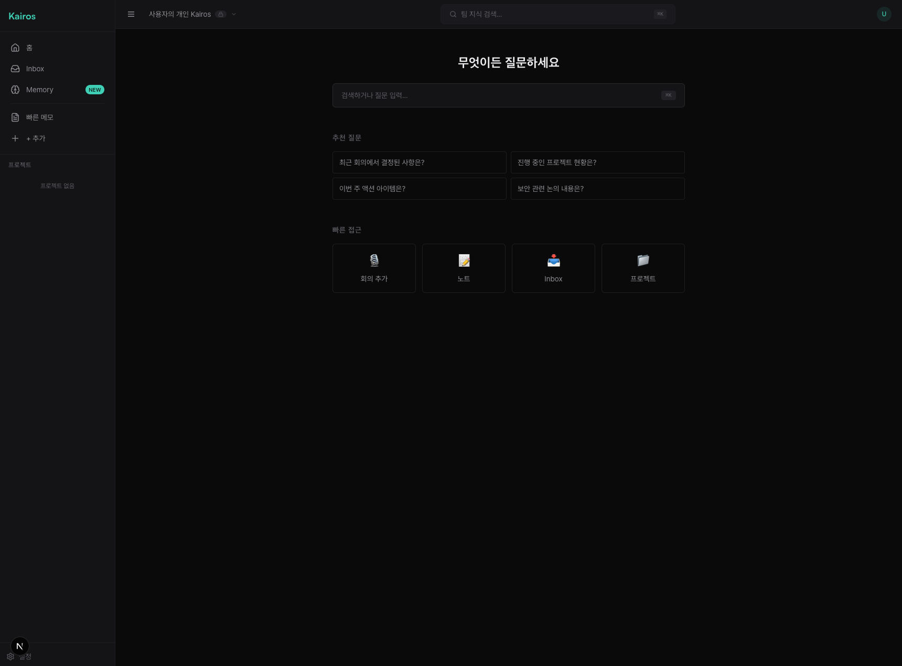
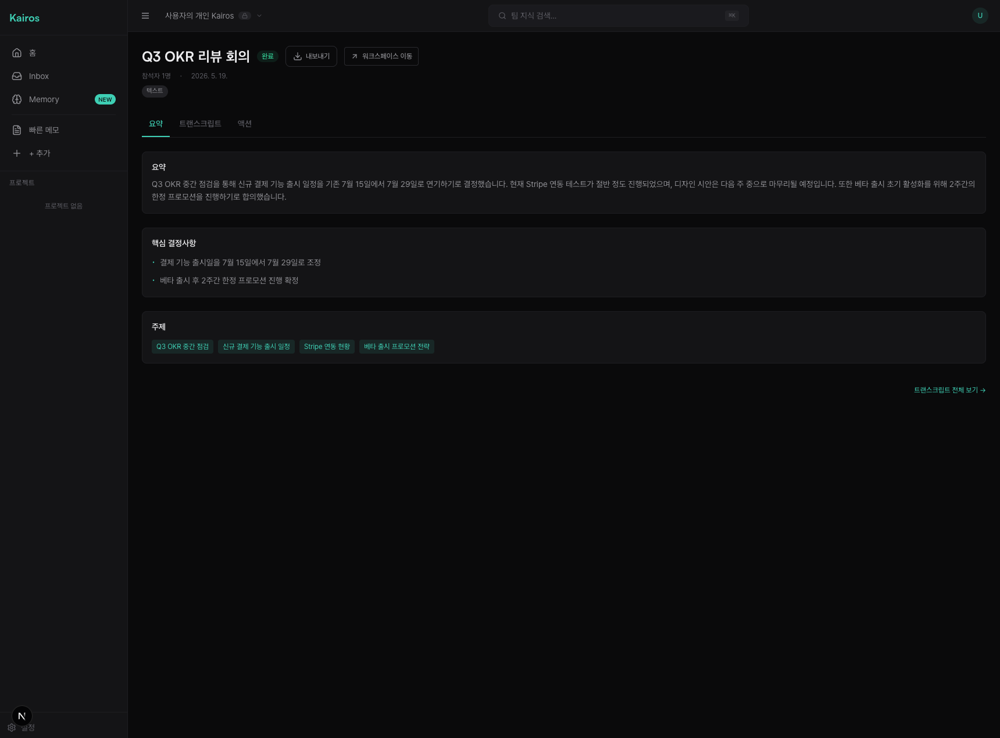
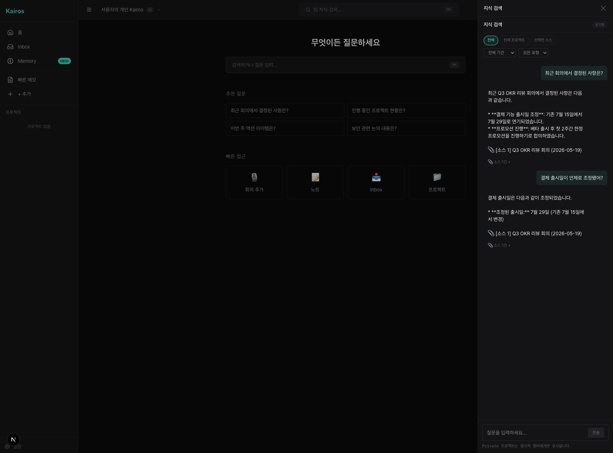
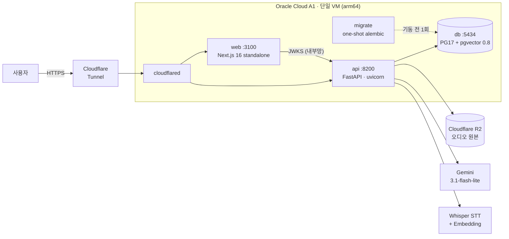
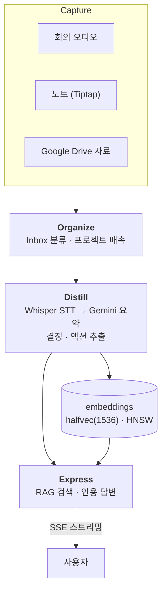
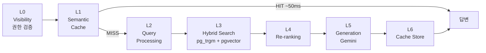

<div align="center">

# Kairos

**팀의 세컨드 브레인** — 회의·노트·자료를 넣으면 AI 가 정리하고, 질문하면 인사이트가 나온다.

*καιρός — 흘러가는 시간(Chronos) 속 결정적 순간. 모든 회의엔 포착해야 할 카이로스가 있다.*

[](https://github.com/woosung-dev/kairos/actions/workflows/test.yml)


**[kairos.woosung.dev](https://kairos.woosung.dev)**



</div>

---

## 목차

1. [Kairos 란](#1-kairos-란)
2. [화면](#2-화면)
3. [시스템 아키텍처](#3-시스템-아키텍처)
4. [기술 스택](#4-기술-스택)
5. [기술적 의사결정](#5-기술적-의사결정)
6. [모노레포 구조](#6-모노레포-구조)
7. [Quick Start](#7-quick-start)
8. [AI 에이전트 협업 워크플로우](#8-ai-에이전트-협업-워크플로우)
9. [배포](#9-배포)
10. [문서](#10-문서)

---

## 1. Kairos 란

세컨드 브레인의 실패 지점은 **Capture 가 아니라 Distill** 이다. 회의록을 녹음해두고, 노트를 쌓아두고,
자료를 모아두는 것까지는 누구나 한다. 그것을 다시 읽고 요약하고 구조화하는 단계에서 전부 멈춘다.

Kairos 는 **그 Distill 단계를 AI 가 완전히 대신하는 것**을 유일한 차별점으로 잡았다.
사용자는 넣기만 하고, 꺼내 쓰기만 한다.

```
[Capture] 회의·노트·자료  →  [Organize] AI 분류·프로젝트 배속
                          →  [Distill] STT → 요약·결정·액션 추출
                          →  [Express] RAG 검색 · 인용 기반 답변
```

**Distill 구현 현황** (`CONTEXT-MAP.md` §1)

| 레벨 | 산출물 | 상태 |
|---|---|---|
| L0 | 원본 (오디오 · 노트 · 외부 문서) | ✅ 완료 |
| L1 | 트랜스크립트 + 요약 | ✅ 완료 |
| L2 | 결정 사항 + 액션 아이템 | ✅ 완료 |
| L3 | 프로젝트 단위 인사이트 | 🚧 부분 |
| L4 | 조직 단위 인사이트 | ⬜ Phase 4 |

경쟁 제품 대비 포지션은 [`docs/requirements/competitive-analysis.md`](docs/requirements/competitive-analysis.md)
(Otter · Granola · Reflect · Mem · Tana 5종 비교), 제품 명세는
[`docs/requirements/prd.md`](docs/requirements/prd.md) 에 있다.

---

## 2. 화면

| 회의 요약 (Distill) | RAG 답변 (Express) |
|---|---|
|  |  |
| 업로드된 오디오를 STT → Gemini 로 요약하고 결정·액션을 자동 추출한다 | 워크스페이스 전체 지식에 질문하면 출처 인용과 함께 SSE 로 스트리밍된다 |

---

## 3. 시스템 아키텍처

### 배포 토폴로지

PaaS 3곳(Vercel · Cloud Run · Neon)에 흩어져 있던 배포를 **오라클 단일 VM 하나**로 합쳤다.
호스트에 열린 인바운드 포트는 **SSH 22 하나뿐**이고, 모든 트래픽은 Cloudflare Tunnel 의 아웃바운드
커넥션을 타고 들어온다.



컨테이너별 자원 캡·포트 배정 근거는 [ADR-028](docs/adr/028-oci-selfhosting.md),
운영 런북은 [`deploy/oci/README.md`](deploy/oci/README.md).

### CODE 파이프라인 데이터 흐름



장기 작업(STT·요약)은 **`BackgroundTasks` + 202 Accepted + 폴링**으로 처리한다. 상세는
[`docs/architecture/ai-pipeline.md`](docs/architecture/ai-pipeline.md).

### RAG 6-Layer

검색은 벡터 유사도 한 방이 아니라 6단계 파이프라인이다. **권한 검증(Layer 0)이 SSE 스트리밍
시작 전에 끝난다** — 스트림이 시작된 뒤에는 되돌릴 수 없기 때문이다.



하이브리드 검색·계층적 청킹·Semantic Cache 설계는
[`docs/architecture/rag-pipeline.md`](docs/architecture/rag-pipeline.md).

---

## 4. 기술 스택

| 레이어 | 기술 |
|---|---|
| **Frontend** | Next.js 16 (App Router) · React 19 · TypeScript strict · Tailwind v4 · shadcn/ui v4 · TanStack Query v5 · Zustand v5 · Zod v4 · Tiptap |
| **Backend** | FastAPI · SQLModel · asyncpg · Pydantic v2 · Python 3.12 (100% async) |
| **Database** | PostgreSQL 17 + pgvector 0.8 (`halfvec(1536)` · HNSW · `iterative_scan`) |
| **Auth** | Better Auth 자체 호스팅 — Google OAuth + 이메일/비밀번호, BE 는 JWKS 로 EdDSA 검증 |
| **AI** | Gemini `gemini-3.1-flash-lite` (요약·생성) · OpenAI Whisper (STT) · `text-embedding-3-small` 1536d |
| **Storage** | Cloudflare R2 (presigned URL · aioboto3) |
| **Infra** | Oracle Cloud A1 단일 VM (arm64) · Docker Compose · Cloudflare Tunnel |
| **Toolchain** | mise (툴체인 핀 + 28 task) · uv 0.10.4 · pnpm 8.15.9 · Node 22 |
| **Test** | pytest + testcontainers(실 PostgreSQL) · vitest · Playwright (chromium / public-only / team) |

---

## 5. 기술적 의사결정

이 프로젝트에서 실제로 판단이 갈렸던 지점들이다. 전체 결정 기록은
[`docs/adr/`](docs/adr/) 에 ADR 30건으로 남아 있다.

### ① PaaS 3곳 → 단일 VM 셀프호스팅 · [ADR-028](docs/adr/028-oci-selfhosting.md)

**상황** — FE 는 Vercel(레포에 설정이 없고 대시보드가 유일한 진실), BE 는 Cloud Run, DB 는 Neon.
여기에 WIF pool · Artifact Registry · Cloud Scheduler 를 따로 관리해야 했다.

**판단** — 이전을 결정하기 전에 **실측부터 했다.** ① 런타임 로컬 ML 추론 0건(STT·LLM·임베딩 전부 외부 API)
→ ARM 이전 리스크 없음. ② Vercel 전용 기능 실사용이 middleware 1개 + `next/image` 1곳뿐
(ISR·edge runtime·server actions 전부 0건). ③ 운영 DB 전체 14MB, 업로드 p95 29초.
→ **PaaS 를 쓸 이유가 실측상 남아 있지 않았다.**

**결과** — 기존 오라클 서버에 컨테이너 5종으로 합류. 다른 프로젝트와 한 호스트를 공유하므로
`cpus: 1.5` 하드 캡으로 격리했고, 인바운드 포트는 22 하나만 남겼다. 롤백은 이미지 태그 교체로 RTO 약 2분.

### ② pgvector 저장·검색 전략 · [ADR-020](docs/adr/020-pgvector-hnsw-halfvec.md)

**상황** — `vector(1536)` fp32 = 6KB/row. ivfflat 은 `lists` 가 정적이라 계속 삽입되는 데이터에 부적합하고,
visibility 포스트필터를 걸면 후보가 모자라 **"검색 결과 0건"** 이 자주 났다.

**판단** — 세 가지를 함께 바꿨다. `halfvec(1536)` 로 저장 절반, HNSW 로 인덱스 교체,
pgvector 0.8 의 `iterative_scan = relaxed_order` 로 포스트필터 부족분 해소.

**함정** — `vector_cosine_ops` 는 halfvec 컬럼과 호환되지 않아 `ALTER COLUMN TYPE` 이
`DatatypeMismatchError` 로 죽는다. 백엔드 표준인 **2단계 배포(무중단) 원칙을 이 마이그레이션에는
적용할 수 없다** — 컬럼 타입 자체가 바뀌기 때문이다. ivfflat drop 을 같은 마이그레이션에 강제하고,
안전망은 alembic downgrade 양방향 복구로 확보했다.

**결과** — 세션 파라미터 주입은 `embeddings/repository.py` 내부에 캡슐화해 RAG 도메인이
pgvector 를 알지 못하게 했다. 재색인 절차는 [런북](docs/operations/pgvector-reindex.md)으로 남겼다.

### ③ 관리형 인증 이탈 · [ADR-031](docs/adr/031-better-auth-migration.md)

**상황** — 컴퓨트·DB 는 셀프호스팅으로 가져왔는데 **신원만 외부(Clerk)에 남았다.** 게다가 webhook 신뢰성
문제로 [ADR-022](docs/adr/022-clerk-webhook-skip.md) 는 "sync 를 skip 한다" 로 미봉된 상태였고,
레포를 public 으로 전환하면서 git 히스토리에 남은 dev secret 도 정리해야 했다.

**판단** — Better Auth 로 자체 호스팅. 토큰 발급은 FE(Next.js)가 하고 **BE 는 JWKS 로 EdDSA 서명만
검증**한다. BE 는 세션 저장소를 갖지 않는다.

**함정** — 로그인용 Google OAuth 클라이언트를 Drive 연동(ADR-026)과 **반드시 분리**해야 한다.
Drive 는 restricted scope 라 앱 검증 대상인데, 로그인을 같은 클라이언트에 얹으면 로그인 자체가
그 검증 반경에 들어가고 시크릿 로테이션이 로그인과 Drive 를 동시에 끊는다.

### ④ FE/BE 타입 드리프트 차단 · [ADR-027](docs/adr/027-apps-monorepo-and-contract-governance.md)

**상황** — 모노레포에서 BE 스키마가 바뀌면 FE 가 조용히 깨진다. 손으로 쓴 wire 타입은 반드시 썩는다.

**판단** — OpenAPI 를 **계약 SSOT** 로 두고 `apps/web/src/types/api.gen.ts` 를 전량 생성물로 만들었다.
수기 wire interface 작성은 금지(불변식 I-22).

**결과** — `mise run contracts-check` 가 계약을 재생성한 뒤 `git diff` 로 drift 를 잡고,
CI 의 `contract-check` job 이 이 게이트를 그대로 돌린다. 스키마를 바꾸고 재생성을 잊으면
**머지가 막힌다.**

### ⑤ 장기 작업과 단일 워커 제약 · [런북](docs/operations/runbooks/stuck-pipeline.md)

**상황** — STT + 요약은 수 분이 걸린다. HTTP 요청 안에서 끝낼 수 없다.

**판단** — `BackgroundTasks` + `202 Accepted` + 폴링. 큐 인프라(Celery/Redis)는 도입하지 않았다 —
1인 프로젝트 규모에서 운영 비용이 이득을 넘는다.

**대가를 명시한다** — ① BackgroundTasks 는 **재시도가 없다.** 프로세스가 교체되면 진행 중이던 회의가
중간 상태로 남는다. ② circuit breaker 와 JWT 캐시가 **in-process 싱글턴**이라 `uvicorn --workers` 를
1 에서 늘릴 수 없다.

**완화** — 배포 전 `mise run deploy-preflight` 가 **진행 중인 작업이 0건인지 확인**하고,
`stop_grace_period: 900s` 로 15분간 종료를 유예한다. 막힌 파이프라인 복구 절차는 런북에 있다.

---

## 6. 모노레포 구조

```
kairos/
├── apps/
│   ├── api/          FastAPI — 도메인 14 + common/core/services  → README.md
│   └── web/          Next.js 16 — FSD features 17               → README.md
├── contracts/        OpenAPI 계약 (SSOT — api.gen.ts 의 원본)
├── deploy/oci/       docker-compose.prod.yml + 서버 운영 런북
├── docs/
│   ├── adr/          아키텍처 결정 기록 30건
│   ├── architecture/ 파이프라인 · ERD · 디렉터리 맵
│   ├── development/  셋업 · 테스트 · 시크릿 · 마이그레이션
│   ├── operations/   배포 · 런북
│   └── requirements/ PRD · 페르소나 · 경쟁 분석
├── CONTEXT-MAP.md    도메인 헌법 — 엔티티 · 경계 · 불변식 I-1~I-22
├── AGENTS.md         개발 원칙 (AI 에이전트 + 사람 공통)
├── DESIGN.md         디자인 시스템 정본
└── mise.toml         툴체인 핀 + task 28개 (단일 진입점)
```

- 백엔드 상세 → [`apps/api/README.md`](apps/api/README.md)
- 프론트엔드 상세 → [`apps/web/README.md`](apps/web/README.md)
- 전체 트리 → [`docs/architecture/directory-map.md`](docs/architecture/directory-map.md)

---

## 7. Quick Start

**필요한 것**: [mise](https://mise.jdx.dev) · Docker(선택 — 로컬 PostgreSQL 용) ·
PostgreSQL 17 + pgvector 0.8 접근 권한

```bash
# 1. 툴체인 — Node 22 / pnpm 8.15.9 / uv 0.10.4 를 프로덕션과 같은 버전으로 설치
brew install mise
mise trust && mise install

# 2. 의존성
mise run install                                # BE uv sync --frozen + FE pnpm install

# 3. 환경변수 — 발급처는 docs/development/secrets.md
cp apps/api/.env.example apps/api/.env          # FastAPI: .env
cp apps/web/.env.example apps/web/.env.local    # Next.js: .env.local

# 4. DB + 실행
mise run be-migrate                             # alembic upgrade head
mise run be-dev                                 # :8000
mise run fe-dev                                 # :3000  (별도 터미널)
```

FE 는 **Mock 모드가 없다** — BE 가 떠 있어야 화면이 동작한다.
전체 셋업 절차는 [`docs/development/getting-started.md`](docs/development/getting-started.md),
환경변수 매트릭스(로컬/CI/프로덕션)는 [`docs/development/secrets.md`](docs/development/secrets.md).

### 테스트

```bash
mise run ci-local          # ★ 머지 게이트 전체를 로컬에서 그대로 재현
mise run be-test           # pytest — CI 와 문자 동일 호출
mise run fe-test           # vitest
mise run fe-build          # next build (타입 검사 포함)
mise run e2e               # Playwright
mise run contracts-check   # OpenAPI 계약 drift 게이트
```

전체 task 목록은 `mise tasks`. mise 없이 각 task 안의 원 명령을 직접 실행해도 된다.
게이트 ↔ CI job 대응표는 [`docs/development/testing.md`](docs/development/testing.md).

---

## 8. AI 에이전트 협업 워크플로우

1인 풀스택 개발 + AI 에이전트 조합으로 운영한다. 사람의 리뷰 대역폭이 병목이므로,
**규칙을 문서가 아니라 실행 가능한 게이트로 만드는 것**을 원칙으로 삼았다.

### 3층 규칙 구조 · [ADR-029](docs/adr/029-ai-rules-relocation.md)

| 층 | 파일 | 로드 시점 |
|---|---|---|
| 프로젝트 원칙 | [`AGENTS.md`](AGENTS.md) | 항상 |
| 스택 규칙 | `apps/api/AGENTS.md` · `apps/web/AGENTS.md` | 해당 디렉터리 작업 시 |
| 불변식 | `apps/*/CONTEXT.md` (B-NN / F-NN) · [`CONTEXT-MAP.md`](CONTEXT-MAP.md) (I-NN) | 경계를 건드릴 때 |

> 같은 규칙을 두 곳에 쓰지 않는다 — 드리프트가 반드시 재발하기 때문이다.
> 규칙은 `CONTEXT.md` 의 번호 붙은 불변식에만 추가한다.

### 코드가 아니라 게이트로 강제하는 것

- **계약 drift** — `contracts-check` 가 OpenAPI 재생성 후 diff 로 차단 (I-22)
- **툴체인 드리프트** — `toolchain-check` 가 `mise.toml [tools]` ↔ Dockerfile 핀 일치 검증
- **도메인 경계** — `apps/api/tests/architecture/` 의 아키텍처 테스트가 금지된 import 를 잡는다
- **권한 회귀** — Playwright `team` project 가 RBAC 시나리오 T1~T23 을 회귀 검증
- **머지 판정** — CI 의 `ci-required` job 하나. `mise run ci-local` 이 같은 게이트를 로컬에서 미리 돌린다

### Atomic Update

코드를 바꾸면 대응하는 canonical doc **1개**를 같은 PR 에 포함한다
(모델→ERD, 엔드포인트→contracts 재생성, 경계→CONTEXT-MAP, 큰 결정→ADR).
라우팅 표는 [`AGENTS.md`](AGENTS.md) §5.

---

## 9. 배포

자동 배포는 없다. **의도적으로 사람이 방아쇠를 당긴다** — 진행 중인 AI 파이프라인이 있으면
프로세스 교체가 그 작업을 죽이기 때문이다(§5-⑤).

맥에서 arm64 네이티브로 빌드해 SSH 파이프로 서버에 넘긴다.

```bash
TAG=$(git rev-parse --short HEAD)
mise run deploy-preflight    # 진행 중 작업 0 확인 + .env 인코딩 게이트
mise run deploy-build $TAG   # arm64 이미지 2종
mise run deploy-ship $TAG    # 전송 + 태그 교체 + 기동
mise run deploy-status       # 컨테이너 상태 + /ready + 호스트 자원
mise run deploy-rollback     # 문제 시 — 이미지 태그 되돌리기 (RTO 약 2분)
```

절차 상세 → [`docs/operations/deployment.md`](docs/operations/deployment.md)
서버 런북(함정 포함) → [`deploy/oci/README.md`](deploy/oci/README.md)

---

## 10. 문서

| 문서 | 내용 |
|---|---|
| [`docs/README.md`](docs/README.md) | **문서 전체 색인** — active doc 의 유일한 entry point |
| [`CONTEXT-MAP.md`](CONTEXT-MAP.md) | 도메인 헌법 — 엔티티 · 경계 · 불변식 I-1~I-22 |
| [`AGENTS.md`](AGENTS.md) | 개발 원칙 + Atomic Update 라우팅 |
| [`DESIGN.md`](DESIGN.md) | 디자인 시스템 정본 (타이포 · 컬러 · 모션) |
| [`docs/adr/`](docs/adr/) | 아키텍처 결정 기록 30건 |
| [`docs/requirements/prd.md`](docs/requirements/prd.md) | PRD + Phase 로드맵 |
| [`docs/architecture/ai-pipeline.md`](docs/architecture/ai-pipeline.md) | STT + Gemini 파이프라인 |
| [`docs/architecture/rag-pipeline.md`](docs/architecture/rag-pipeline.md) | RAG 6-Layer 설계 |
| [`docs/architecture/erd.md`](docs/architecture/erd.md) | 데이터 모델 (ERD) |
| [`docs/development/getting-started.md`](docs/development/getting-started.md) | 로컬 셋업 정본 |
| [`docs/development/secrets.md`](docs/development/secrets.md) | 환경변수 전체 매트릭스 |
| [`docs/development/testing.md`](docs/development/testing.md) | 테스트 게이트 ↔ CI job 대응표 |
| [`docs/development/migrations.md`](docs/development/migrations.md) | alembic 규약 + 2단계 배포와 그 예외 |
| [`docs/operations/deployment.md`](docs/operations/deployment.md) | 배포 절차 |
| [`docs/product/glossary.md`](docs/product/glossary.md) | 도메인 용어 색인 |
| [`docs/TODO.md`](docs/TODO.md) | 열린 작업 (Blocked / Questions / Next Actions) |
| [`docs/REFACTORING-BACKLOG.md`](docs/REFACTORING-BACKLOG.md) | 기술 부채 백로그 (BL-NNN) |

### 기여 · 이슈

[버그 리포트](.github/ISSUE_TEMPLATE/bug-report.yml) ·
[기능 제안](.github/ISSUE_TEMPLATE/feature-request.yml) ·
[PR 템플릿](.github/PULL_REQUEST_TEMPLATE.md) ·
[보안 정책](.github/SECURITY.md)
