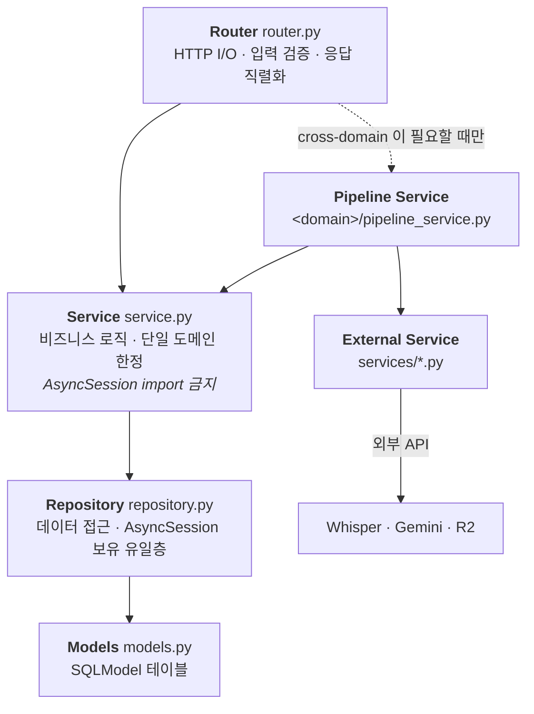

# Kairos API (FastAPI)

Kairos 의 백엔드 애플리케이션. REST + SSE, AI 파이프라인 조율(STT / Gemini / 임베딩), DB 영속화.
OCI 단일 VM 위 컨테이너로 배포된다 ([ADR-028](../../docs/adr/028-oci-selfhosting.md) · [ADR-030](../../docs/adr/030-apps-api-rename.md)).

## 실행

명령은 루트 `mise.toml` 이 단일 진입점이다.

```bash
mise run install      # uv sync --frozen
mise run be-migrate   # alembic upgrade head
mise run be-dev       # uvicorn :8000
mise run be-test      # pytest (CI 와 문자 동일 호출)
mise run contracts    # OpenAPI 계약 + FE 타입 재생성
```

환경변수는 `.env.example` → `.env`. 전체 매트릭스는
[`docs/development/secrets.md`](../../docs/development/secrets.md), 셋업 전체는
[`docs/development/getting-started.md`](../../docs/development/getting-started.md).

API 문서는 개발 서버 기동 후 `http://localhost:8000/api/v1/docs` (Swagger UI).

## 레이어

한 방향으로만 흐른다. **`AsyncSession` 을 보유하는 유일한 층은 Repository** 이고,
`commit()` 은 Service 의 요청으로만 일어난다.



**도메인 간 호출 규칙** (헌법 §4.2 · [ADR-014](../../docs/adr/014-service-boundary.md))

| 케이스 | 정책 |
|---|---|
| 도메인 A → 도메인 B `.repository` (read) | ✅ 허용 — workspace 검증 필수 |
| 도메인 `service.py` 끼리 직접 호출 | ❌ 금지 |
| cross-domain shared service (embeddings / ai_processing / transcription) | orchestrator 경계 내부만 |
| 3개 이상 모듈 + commit 트랜잭션 | orchestrator 필수 |

상세: [`docs/architecture/cross-domain-pipeline.md`](../../docs/architecture/cross-domain-pipeline.md)

## 구조

```
apps/api/
├── src/
│   ├── main.py            FastAPI app + 라우터 조립 + /health · /ready 프로브
│   ├── core/              config(get_settings) · lifespan
│   ├── common/            visibility · pagination · prompts · r2 · fk_guard · audit/promote (audit_router 포함)
│   ├── services/          외부 API wrapper (transcription · chunked_transcription · ai_processing · ai_resilience)
│   └── <domain>/          router · service · repository · schemas · models · dependencies · exceptions
│                          (+ cross-domain 오케스트레이터가 필요한 5 도메인만 pipeline_service.py —
│                           meetings · notes · rag · memory · integrations)
├── alembic/               마이그레이션 25 리비전. Better Auth `auth_*` 5 테이블 DDL 도 여기서 적용 (ADR-031 D4)
├── scripts/               export_openapi.py(계약 생성) · reindex_vectors.py · r2_cleanup.py · 벤치/시드 스크립트
├── tests/                 pytest 125 파일 — integration(testcontainers 실 PostgreSQL) · architecture(규칙 게이트)
├── Dockerfile             multi-stage — uv 0.10.4 builder → python:3.12-slim + ffmpeg 런타임 (약 735MB, ADR-028 D9)
└── docker-entrypoint.sh   role 분기 — migrate(one-shot) / api
```

### 도메인 모듈 (14)

| 모듈 | 책임 |
|---|---|
| [`auth`](src/auth/CONTEXT.md) | JWKS 기반 JWT 검증 + User 매핑 ([ADR-031](../../docs/adr/031-better-auth-migration.md)) |
| [`workspaces`](src/workspaces/CONTEXT.md) | Workspace · WorkspaceMember · WorkspaceInvite · `inbox_threshold` |
| [`projects`](src/projects/CONTEXT.md) | Project CRUD · MeetingProjectLink · ProjectMember · visibility 권한 분기 · 태그 · 인사이트 |
| [`inbox`](src/inbox/CONTEXT.md) | Inbox 적재 + AI 분류 추천 |
| [`meetings`](src/meetings/CONTEXT.md) | Meeting 인제스트 · STT · 파이프라인 (orchestrator 표준 패턴) |
| [`notes`](src/notes/CONTEXT.md) | Tiptap Note CRUD + 임베딩 위임 · 권한 검증 |
| [`actions`](src/actions/CONTEXT.md) | ActionItem CRUD (부모 nullable) |
| [`memory`](src/memory/CONTEXT.md) | Recall wedge — capture(text+voice) / Distill / Recall / Promote |
| [`rag`](src/rag/CONTEXT.md) | RAG 6-Layer + Gemini 답변 (SSE 스트리밍) |
| [`embeddings`](src/embeddings/CONTEXT.md) | EmbeddingChunk + SemanticCache (pgvector HNSW + halfvec). cross-domain shared service |
| [`integrations`](src/integrations/CONTEXT.md) | 외부 소스 인제스트 레일 — Google Drive 연결 · sync 상태 ([ADR-026](../../docs/adr/026-external-source-ingest-rail.md)) |
| [`upload`](src/upload/CONTEXT.md) | R2 업로드 (presigned URL · aioboto3) |
| [`onboarding`](src/onboarding/CONTEXT.md) | `User.onboarding_step` (0~4) lifecycle — 타 도메인이 hook 호출 |
| [`feedback`](src/feedback/CONTEXT.md) | dogfooding 피드백 수집 (user-level · workspace nullable) |

전체 트리는 [`docs/architecture/directory-map.md`](../../docs/architecture/directory-map.md),
모듈별 상세 책임은 [`CONTEXT.md`](CONTEXT.md) §4.
배포 토폴로지 안에서 이 앱이 차지하는 자리(컨테이너 · 포트 · 외부 API)와 테이블 31개의 그룹 지도는
[`docs/architecture/diagrams/`](../../docs/architecture/diagrams/README.md) 의 인터랙티브 다이어그램.

### 관리 표면 — 별도 admin 앱은 없다

| 경로 | 인증 | 용도 |
|---|---|---|
| `GET /api/v1/workspaces/{workspace_id}/memory/metrics` | workspace viewer 이상 (`require_viewer`) | FE `admin/recall-metrics` 데이터. founder 제한은 `NEXT_PUBLIC_FOUNDER_USER_ID`를 비교하는 FE 표시 게이트이며 API 인가 경계가 아니다 |
| `POST /api/v1/admin/memory/r2-cleanup` | `CRON_SECRET_TOKEN` (`verify_cron_token`) | 음성 메모 R2 객체 30일 정리 (`memory/admin_router.py`). 정기 호출 주체는 레포 안에 없다 — GitHub Actions `r2-cleanup.yml` 은 `uploads/` 정리용 `scripts/r2_cleanup.py` 를 직접 실행한다 |
| `GET /api/v1/workspaces/{workspace_id}/audit/promotions` | workspace admin/owner (`require_admin`) | promote 감사 trail 조회 — Settings 의 Audit 탭 (`common/audit_router.py`) |

## 환경변수

값은 여기에 적지 않는다. 발급처와 로컬/CI/프로덕션 매트릭스는
[`docs/development/secrets.md`](../../docs/development/secrets.md).

| 그룹 | 키 | 용도 |
|---|---|---|
| 앱 | `APP_ENV` `LOG_LEVEL` `CORS_ORIGINS` `FRONTEND_URL` | 실행 환경 · CORS 허용 출처 |
| DB | `DATABASE_URL` | `postgresql+asyncpg://` 스킴 고정 |
| Auth | `AUTH_JWT_ISSUER` `AUTH_JWKS_URL` `AUTH_JWT_AUDIENCE` `AUTH_JWT_ALGORITHMS` `AUTH_PROD_HARDENING` | Better Auth 발급 토큰 검증 (EdDSA) |
| Storage | `R2_ACCOUNT_ID` `R2_ACCESS_KEY_ID` `R2_SECRET_ACCESS_KEY` `R2_BUCKET_NAME` | Cloudflare R2 |
| AI | `GEMINI_API_KEY` `OPENAI_API_KEY` | Gemini 생성 · Whisper STT · 임베딩 |
| 외부 연동 | `INTEGRATIONS_ENCRYPTION_KEY` `GOOGLE_OAUTH_*` `GOOGLE_PICKER_API_KEY` | Drive 연동 — **로그인용 Google 클라이언트와 분리** |
| 운영 | `CRON_SECRET_TOKEN` `KAIROS_FOUNDER_USER_ID` | 정기 작업 인증 · 관리 계정 |

프로덕션 `AUTH_JWKS_URL` 은 compose 내부망(`http://web:3000/api/auth/jwks`)을 가리킨다.

## 테스트

```bash
mise run be-test    # pytest -v (CI 와 문자 동일)
```

- **테스트 파일 125개.** `asyncio_mode = auto` 라 `@pytest.mark.asyncio` 를 붙이지 않는다
- **`integration` 마커** — testcontainers 로 **실제 PostgreSQL** 을 띄운다. pgvector 동작은
  SQLite 로 대체 검증할 수 없기 때문에 목이 아니라 실 DB 를 쓴다
- **아키텍처 테스트** (`tests/architecture/`) — 규칙을 문서가 아니라 테스트로 강제한다
  - `test_service_no_asyncsession_instance.py` — Service 층의 `AsyncSession` 보유 금지
  - `test_no_memory_to_embeddings_lazy_import.py` — 도메인 경계 우회 import 차단
  - `test_prompts_centralized.py` — 프롬프트 인라인 작성 금지 (`common/prompts.py` 만)
  - `test_visibility_single_source.py` · `test_visibility_characterization.py` — visibility 판정 SSOT
  - `test_core_common_import_allowlist.py` — `core`/`common` 의 역방향 의존 차단
- **CI 제외 2건** — `tests/services/test_transcription.py`(실 Whisper API 호출) ·
  `tests/test_r2_cors_regression.py`(실 R2 버킷 필요). 외부 자격증명이 있어야 도는 테스트라
  게이트에서 뺐다. 로컬에서 `uv run pytest tests/services/test_transcription.py` 로 따로 돌린다

게이트 ↔ CI job 대응표: [`docs/development/testing.md`](../../docs/development/testing.md)

## ★ 운영자가 알아야 하는 제약

- **`uvicorn --workers` 를 1 에서 늘리지 않는다.** `services/ai_resilience.py` 의 circuit breaker 와
  `auth` 의 JWT/User 캐시가 **in-process 싱글턴**이라 멀티워커에서 상태가 파편화된다
- **`BackgroundTasks` 는 재시도가 없다.** 프로세스가 교체되면 진행 중이던 회의가 중간 상태로 남는다 →
  배포 전 `mise run deploy-preflight` 필수. 복구 절차는
  [런북](../../docs/operations/runbooks/stuck-pipeline.md)
- 마이그레이션은 앱 기동과 분리된 one-shot 컨테이너가 적용한다 (crash-loop 방지)

## 규칙

- 스택 함정 + 코드 스켈레톤: [`AGENTS.md`](AGENTS.md)
- 불변식 (B-NN) + 레이어 + 도메인 표: [`CONTEXT.md`](CONTEXT.md)
- 도메인 헌법: [`/CONTEXT-MAP.md`](../../CONTEXT-MAP.md)
- 테스트 게이트: [`docs/development/testing.md`](../../docs/development/testing.md)
