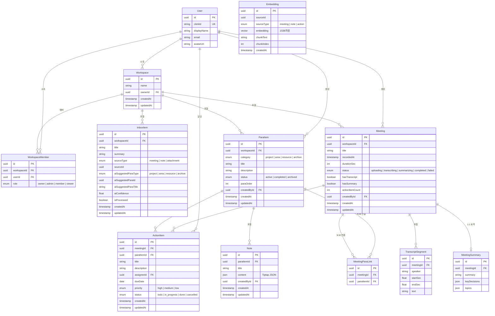

# 데이터 모델 관계도 (ERD)

## 핵심 엔티티 관계

## 관계 설명

### N:M 관계
- **Meeting ↔ ParaItem**: `MeetingParaLink` 중간 테이블로 다대다 연결. 하나의 회의가 여러 PARA 아이템에 연결 가능.

### 1:N 관계
- **Workspace → ParaItem, Meeting, InboxItem**: 모든 콘텐츠는 워크스페이스 소속
- **ParaItem → ActionItem, Note**: PARA 아이템 하위에 액션/노트 종속
- **Meeting → TranscriptSegment, ActionItem**: 회의에서 트랜스크립트와 액션 아이템 추출

### 1:1 관계
- **Meeting → MeetingSummary**: 회의당 AI 요약 하나

### 임베딩 (폴리모픽)
- **Embedding**: `sourceType`과 `sourceId`로 Meeting, Note, ActionItem 등 다양한 소스와 연결
- pgvector 1536차원 (text-embedding-3-small 기준)
