# 데이터 모델 관계도 (ERD)

## 핵심 엔티티 관계

```mermaid
erDiagram
    User {
        uuid id PK
        string clerk_id UK
        string display_name
        string email
        string avatar_url
    }

    Workspace {
        uuid id PK
        string name
        uuid owner_id FK
        timestamp created_at
        timestamp updated_at
    }

    WorkspaceMember {
        uuid id PK
        uuid workspace_id FK
        uuid user_id FK
        enum role "owner | admin | member | viewer"
    }

    InboxItem {
        uuid id PK
        uuid workspace_id FK
        string title
        string summary
        enum source_type "meeting | note | attachment"
        uuid source_id
        uuid ai_suggested_project_id
        string ai_suggested_project_title
        jsonb ai_suggested_tags "AI 자동 부여 태그"
        float ai_confidence
        boolean is_processed
        timestamp created_at
        timestamp updated_at
    }

    Project {
        uuid id PK
        uuid workspace_id FK
        string title
        string description
        enum status "active | completed | archived"
        enum visibility "public | draft | private (Sprint 6, default public, indexed)"
        jsonb tags "AI 자동 분류 + 사용자 태그"
        int sort_order
        uuid created_by_id FK
        timestamp created_at
        timestamp updated_at
    }

    ProjectMember {
        uuid id PK
        uuid project_id FK "indexed"
        uuid user_id FK "indexed"
        string role "Sprint 6 1차: member 단일 (AD-27)"
        timestamp created_at
    }

    WorkspaceInvite {
        uuid id PK
        uuid workspace_id FK
        string code UK "nanoid 12자리"
        string role "owner 제외"
        string default_project_visibility "Sprint 6: public | draft | private (default public)"
        uuid created_by_id FK
        int max_uses "null = 무제한"
        int use_count
        timestamp expires_at "null = 만료 없음"
        boolean is_active
        timestamp created_at
    }

    Meeting {
        uuid id PK
        uuid workspace_id FK
        string title
        timestamp recorded_at
        int duration_sec
        enum status "uploading | transcribing | summarizing | completed | failed"
        boolean has_transcript
        boolean has_summary
        int action_item_count
        uuid created_by_id FK
        timestamp created_at
        timestamp updated_at
    }

    MeetingProjectLink {
        uuid id PK
        uuid meeting_id FK
        uuid project_id FK
    }

    TranscriptSegment {
        uuid id PK
        uuid meeting_id FK
        string speaker
        float start_sec
        float end_sec
        string text
    }

    MeetingSummary {
        uuid id PK
        uuid meeting_id FK
        string summary
        json key_decisions
        json topics
    }

    ActionItem {
        uuid id PK
        uuid meeting_id FK
        uuid project_id FK
        string title
        string description
        uuid assignee_id FK
        date due_date
        enum priority "high | medium | low"
        enum status "todo | in_progress | done | cancelled"
        timestamp created_at
        timestamp updated_at
    }

    Note {
        uuid id PK
        uuid project_id FK
        string title
        json content "Tiptap JSON"
        uuid created_by_id FK
        timestamp created_at
        timestamp updated_at
    }

    EmbeddingChunk {
        uuid id PK
        uuid workspace_id FK
        uuid project_id FK "프로젝트 범위 검색용"
        uuid source_id
        enum source_type "meeting | note | action"
        vector embedding "1536차원"
        string chunk_text
        int chunk_index
        int chunk_level "0:document 1:section 2:paragraph"
        uuid parent_chunk_id FK "계층적 청킹 부모 참조"
        jsonb metadata "speaker, date, topic 등"
        timestamp created_at
    }

    SemanticCache {
        uuid id PK
        uuid workspace_id FK
        uuid project_id FK "범위별 캐시"
        string question
        vector question_embedding "1536차원"
        string answer
        jsonb sources "출처 목록"
        int hit_count
        timestamp created_at
        timestamp expires_at "TTL 7일"
    }

    User ||--o{ Workspace : "소유"
    Workspace ||--o{ WorkspaceMember : "멤버"
    User ||--o{ WorkspaceMember : "소속"
    Workspace ||--o{ InboxItem : "포함"
    Workspace ||--o{ Project : "포함"
    Workspace ||--o{ Meeting : "포함"
    Project ||--o{ ActionItem : "포함"
    Project ||--o{ Note : "포함"
    Meeting ||--o{ TranscriptSegment : "포함"
    Meeting ||--o| MeetingSummary : "1:1 요약"
    Meeting ||--o{ ActionItem : "추출"
    Meeting ||--o{ MeetingProjectLink : "N:M 연결"
    Project ||--o{ MeetingProjectLink : "N:M 연결"
    Project ||--o{ ProjectMember : "Sprint 6: visibility=private 시 명시 멤버"
    User ||--o{ ProjectMember : "Sprint 6: 명시 매핑"
    Workspace ||--o{ WorkspaceInvite : "초대 링크 발급"
    User ||--o{ WorkspaceInvite : "생성자"
    User ||--o{ Project : "생성"
    User ||--o{ Meeting : "생성"
    User ||--o{ ActionItem : "담당"
    Workspace ||--o{ EmbeddingChunk : "포함"
    Workspace ||--o{ SemanticCache : "포함"
    Project ||--o{ EmbeddingChunk : "범위 검색"
    Project ||--o{ SemanticCache : "범위별 캐시"
    EmbeddingChunk ||--o{ EmbeddingChunk : "부모-자식 계층"
```

## 관계 설명

### N:M 관계
- **Meeting ↔ Project**: `MeetingProjectLink` 중간 테이블로 다대다 연결. 하나의 회의가 여러 프로젝트에 연결 가능.
- **Project ↔ User** (Sprint 6 L-6): `ProjectMember` 중간 테이블. visibility=`private` Project에 명시 매핑된 사용자만 read/write. admin/owner는 우회. `(project_id, user_id)` 유일 (마이그레이션 `754f571d5544`).

### 1:N 관계
- **Workspace → Project, Meeting, InboxItem**: 모든 콘텐츠는 워크스페이스 소속
- **Project → ActionItem, Note**: 프로젝트 하위에 액션/노트 종속
- **Meeting → TranscriptSegment, ActionItem**: 회의에서 트랜스크립트와 액션 아이템 추출
- **Workspace → EmbeddingChunk, SemanticCache**: 멀티테넌시 격리
- **Project → EmbeddingChunk**: 프로젝트 범위 검색 (프로젝트 단위 RAG)
- **Project → SemanticCache**: 프로젝트 범위별 캐시 격리

### 1:1 관계
- **Meeting → MeetingSummary**: 회의당 AI 요약 하나

### 자기 참조 (Self-referencing)
- **EmbeddingChunk → EmbeddingChunk**: `parentChunkId`로 계층적 청킹 구현. Level 2(문단)가 Level 1(화자 구간)을 부모로 참조.

### 임베딩 (폴리모픽)
- **EmbeddingChunk**: `sourceType`과 `sourceId`로 Meeting, Note, ActionItem 등 다양한 소스와 연결
- 1536차원 벡터 (text-embedding-3-small 기준)
- `chunkLevel`: 0(document) / 1(section) / 2(paragraph) — 검색 대상은 Level 2만
- `metadata` (JSONB): 화자명, 시간, 토픽 등 동적 메타데이터

### Semantic Cache
- **SemanticCache**: 의미적으로 유사한 질문에 대해 캐시된 답변을 즉시 반환
- `questionEmbedding`: 질문 벡터로 유사도 ≥ 0.93 시 캐시 히트
- `expiresAt`: TTL 7일 자동 만료
- 데이터 변경 시 해당 `projectId`의 캐시 무효화
- 상세 설계: [RAG 파이프라인 설계](rag-pipeline.md) 참조
