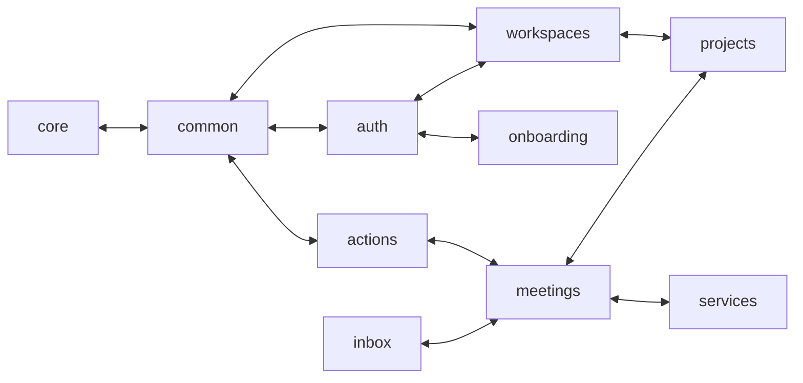

<!-- Sprint 28 Round A — Architecture 정적 audit (Sprint 27e Round 1+2 carry verify + 신규 발견) -->

# Sprint 28 Round A — Architecture 정적 audit

- 검사 일시: 2026-05-25 KST
- baseline commit: `3e41893` (Sprint 27e Post-Merge dogfooding-blocker 3건 fix 직후 main)
- branch: `sprint-28/dogfooding-stabilize`
- 검사 범위: 헌법 (`CONTEXT-MAP.md` §6 I-1~21 + §4.1/§4.3 모듈 경계) / ADR (014/019/020/021/022/023/024) / SOLID + DRY + KISS / Demeter / 결합도-응집도 / Atomic Update governance / 토큰컷 회귀 (BL-S26-1)
- 비전 정합: PERSONA-001 1인 풀스택 + second-brain pivot + Atomic Update
- 분석 모드: **정적 only** (file:line + grep + AST LOC 측정 + `wc -c` 토큰컷 + 의존성 그래프). dynamic verify (runtime config / lifespan / import cycle runtime) 는 Round B 책임.
- Round 1+2 산출물 cross-check: `docs/sprints/sprint-27e-multi-review/architecture-findings.md` + `architecture-findings-r2.md`

---

## 1. Sprint 27 carry verify (14건)

main HEAD `3e41893` 기준 file:line 재검증.

| ID | Sprint 27 분류 | Sprint 28 검증 file:line | 결과 |
|---|---|---|---|
| **ARCH-1** | P1 carry | `backend/src/onboarding/service.py:18-20, 28-34` — `self._session = session` (line 19) + `self._session.execute(text("SELECT onboarding_step..."))` (line 28-34) 그대로. `repository.py:14` raw text() 유지. | ❌ **잔존** (헌법 I-1 명백 위반) |
| **ARCH-2** | P2 carry | `backend/src/services/transcription.py:14` `from src.meetings.models import TranscriptSegment` 그대로. transcribe() 반환 line 126 + transcribe_with_chunking() line 189 모두 ORM 인스턴스 생성. | ❌ **잔존** (DIP 위반) |
| **ARCH-3** | P2 carry | `common/audit_router.py:14,18` (`from src.auth.rbac import require_admin` + `from src.workspaces.models import WorkspaceMember`) 그대로 + `common/promote_helpers.py:172,173` (`from src.actions.models import ActionItem` + `from src.workspaces.models import WorkspaceMember`) — Round 1+2 에선 173 만 catch, 172 (actions) 누락 발견. | ❌ **잔존 + 신규 actions 역의존 발견** (Layered 위반) |
| **ARCH-4** | P2 carry — Round 2 partial fix | `CONTEXT-MAP.md:43` "백엔드 모듈 (15)" + line 60 "(14)" 정합. `.claude/CLAUDE.md:32` "BE 15 모듈 + FE 14 features" 정합. `docs/architecture/directory-map.md:30-62` 만 FE features 7개 (`inbox/projects/meetings/actions/editor/memory/rag`) stale + `directory-map.md:91-99` common 폴더 list (`database/exceptions/r2/prompts/pagination`) 가 `audit_repository/audit_router/audit_schemas/promote_helpers/promote_models` 5 파일 누락. | ⚠️ **부분 해소** (헌법 + .claude/CLAUDE.md 정합, directory-map.md 만 stale) |
| **ARCH-5** | P3 carry — Round 2 격상 권고 | `rag/service.py:38` `session = self.embedding_repo.session` 그대로. `projects/service.py:82`, `workspaces/service.py:58`, `meetings/pipeline_service.py:166` 동일 패턴 — 4 곳 산재 verified. 추가: `meetings/service.py:385,389,390` 가 `self.repo.session.add/flush` 직접 호출 — 5번째 Demeter 위반 사이트. | ❌ **잔존 + 신규 1 사이트 발견 (5 곳 산재)** |
| **ARCH-6** | P2 carry | AST 측정 — 60+ LOC method 13개. 최대 = `rag/service.py:45` ask 190 LOC. promote 5 도메인 100+ LOC 모두 잔존 (`meetings:256` 166 / `notes:225` 121 / `notes:381` _bg 110 / `meetings:428` _bg 110 / `memory:405` 100 / `inbox:158` 98 LOC). | ❌ **잔존** (SRP 위반) |
| **ARCH-7** | P3 carry — Round 1 governance | `docs/REFACTORING-BACKLOG.md:474` BL-005 "✅ 완료 (Sprint 19 PR #1 C10, 2026-05-18)" 마크 적용 verified. | ✅ **해소** (Round 2 fix bundle 반영) |
| **ARCH-r2-1** | P1 carry — service.py cross-import | `auth/dependencies.py:249-250` + `projects/service.py:81-82` + `workspaces/service.py:57-58` + `rag/service.py:37-39` + `meetings/pipeline_service.py:165-166` 모두 그대로 (5 곳, dependencies 1 + service.py 3 + pipeline_service 1). | ❌ **잔존** (ADR-014 service.py 끼리 import 5 사이트) |
| **ARCH-r2-2** | P3 carry — auth raw text() | `auth/dependencies.py:193-206` (User INSERT) + `:217-226` (Workspace INSERT) + `:228-` (WorkspaceMember INSERT) 모두 raw `text()` 그대로. | ❌ **잔존** (lazy seed 책임 dependency layer 누적) |
| **ARCH-r2-3** | P2 carry — services DTO 불일치 | `services/transcription.py:189` `TranscriptSegment(...)` ORM vs `services/chunked_transcription.py:182-188` `list[dict]` — 두 패턴 공존 그대로. | ❌ **잔존** (ARCH-2 동반) |
| **ARCH-r2-4** | P3 carry — global handler exception unlogged | `backend/src/main.py:142` `logger.exception("global_unhandled_5xx", exc_info=exc, extra={"path": str(request.url.path)})` 적용 verified. Sentry SKIP path forensic 보장. | ✅ **해소** (Round 2 fix bundle 반영) |
| **ARCH-r2-5** | P3 carry — CONTEXT-MAP 카운트 vs list | `CONTEXT-MAP.md:43-45` "백엔드 모듈 (15): auth · workspaces · projects · inbox · meetings · notes · actions · memory · onboarding · upload · embeddings · rag · common · core · services" — 카운트=list=15 정합. line 60 "(14)" + list 14 정합. | ✅ **해소** (Round 2 fix bundle 반영) |
| **ARCH-r2-6** | INFO carry — ADR-022/024 정합 | `sync_user` handler / `/users/sync` endpoint grep 0 hit verified. `core/config.py:8` `_CRON_TOKEN_DEV_FALLBACK` + `:77-86` `_no_default_cron_in_prod` + `:89-98` `_no_dev_issuer_in_prod` validator 정합. | ✅ **정합 유지** |
| **ARCH-r2-7** | P3 carry — 토큰컷 회귀 | `wc -c CONTEXT-MAP.md` = **8,007 bytes** (Round 2 측정 7,960 bytes 대비 +47 bytes 추가 회귀, line 106 동일). `BL-S26-1 docs/REFACTORING-BACKLOG.md:238-252` 본문에 "⚠️ Sprint 27e Round 2 회귀 발견" 마크 적용 verified. | ⚠️ **마크 해소 + 회귀 미진척** (8,007 bytes > 목표 ~3,000 bytes, 167% 초과) |

**carry verify summary**:
- 해소 = 4건 (ARCH-7, ARCH-r2-4, ARCH-r2-5, ARCH-r2-6)
- 부분 해소 = 2건 (ARCH-4 directory-map 만 stale, ARCH-r2-7 BL 마크만 해소)
- 잔존 = 8건 (ARCH-1, ARCH-2, ARCH-3, ARCH-5, ARCH-6, ARCH-r2-1, ARCH-r2-2, ARCH-r2-3)

Round 1+2 의 file:line 정확성 + 분류 정합 모두 재확인. 단 ARCH-3 가 `promote_helpers.py:172` (actions 역의존) 추가 catch + ARCH-5 가 `meetings/service.py:385,389,390` 5번째 Demeter 사이트 신규 발견.

---

## 2. 신규 발견 매트릭스 (Sprint 28, 7건)

| ID | 원칙/ADR | 심각도 | 차단 | file:line | 발견 | 권장 fix |
|---|---|:-:|:-:|---|---|---|
| **BUG-S28-ARCH-1** | Layered Architecture (common 역의존 확장) | P2 | NO | `common/promote_helpers.py:172` | Round 1+2 는 `:173` workspaces 역의존만 catch — 같은 함수의 `:172` `from src.actions.models import ActionItem` 누락. common 이 **3개 상위 도메인 (auth/workspaces/actions)** 역의존. ARCH-3 audit 도메인 분리 시 actions 도 같은 패턴 답습 risk. | ARCH-3 fix (audit 도메인 신설) 시 actions 모델 참조도 audit/promote_helpers 로 이동. 또는 ItemPromotionAudit 의 source_item_id polymorphism 분리. |
| **BUG-S28-ARCH-2** | Demeter (5번째 위반 사이트) + Repository 캡슐화 | P2 | NO | `meetings/service.py:385, 389, 390` | `clone_action_items_for_promote(session=self.repo.session, ...)` 가 repo 의 session 우회 추출 + 직접 `self.repo.session.add(new_meeting)` + `await self.repo.session.flush()`. ARCH-5 의 4 곳 (rag/projects/workspaces/meetings-pipeline) + 본 1 곳 = 5 곳 산재. `MeetingRepository.add_and_flush(meeting)` 캡슐화 메서드 부재 → service 가 직접 ORM 조작. | (a) `MeetingRepository.add_and_flush(meeting: Meeting) -> None` 추가 (또는 `update_action_count(meeting_id, count)` 더 좁은 메서드). (b) `clone_action_items_for_promote` 의 `session=` 인자도 repository 인터페이스 (예: `target_repo: MeetingRepository`) 로 교체. ARCH-r2-1 격상 권고와 묶음 — 5 사이트 동시 정리. |
| **BUG-S28-ARCH-3** | Atomic Update — directory-map.md stale | P3 | NO | `docs/architecture/directory-map.md:30-62, 91-99` | (a) FE features 섹션 7개 (inbox/projects/meetings/actions/editor/memory/rag) 만 표기 — 실재 14 (audit/home/members/onboarding/sources/upload/workspaces 7건 누락). (b) BE common 폴더 list (database/exceptions/r2/prompts/pagination 5개) — 실재 10 (audit_repository/audit_router/audit_schemas/promote_helpers/promote_models 5건 누락). (c) BE services 폴더에 `chunked_transcription.py` 미표시. ARCH-4 의 헌법/CLAUDE.md fix 회수가 directory-map 까지 전파되지 않은 governance 누락. | 1 PR — directory-map FE/BE list 전수 재작성 (실재 ls 결과 기반). 본 sprint 안 ~20분 governance fix 권고. |
| **BUG-S28-ARCH-4** | Module dependency graph — 양방향 의존성 확장 | P2 | NO | 의존성 그래프 §5 | Round 1 측정 양방향 4 쌍 (meetings↔projects, workspaces↔projects, services→meetings 단방향, common→auth/workspaces 단방향). Sprint 28 측정 = **11 쌍 양방향**: `actions↔common`, `actions↔meetings`, `auth↔common`, `auth↔onboarding`, `auth↔workspaces`, `common↔core`, `common↔workspaces`, `inbox↔meetings`, `meetings↔projects`, `meetings↔services`, `projects↔workspaces`. 특히 `common↔core` (core/lifespan.py:8 `from src.common.database import dispose_engine, init_engine` + common/* → core/config) 가 **layered 최하위 두 layer 의 cycle** — Python import order 깨지면 ImportError. `auth↔onboarding` 은 OnboardingService cross-import (ARCH-r2-1) 의 직접 결과. | (a) `core ↔ common` 분리 — `common/database.py` 를 `core/database.py` 로 이동 (database engine init 은 lifespan 책임). (b) `auth ↔ onboarding` 은 ARCH-r2-1 fix 와 묶음. (c) Round 2 의 4 쌍은 사실 lazy import + model-only 로 회피된 사례 — 본 11 쌍 측정이 fresh ground truth. |
| **BUG-S28-ARCH-5** | Architecture test gate 부족 | P2 | NO | `backend/tests/architecture/` | 현재 1개 test (`test_no_memory_to_embeddings_lazy_import.py` — BL-006 회귀 가드만). I-1 (service AsyncSession 보유), ADR-014 (service.py cross-import), common 역의존 (ARCH-3), Demeter (self.<repo>.session) 위반 회귀 가드 부재. Sprint 27 의 ARCH-r2-1 이 4 곳 산재 + Sprint 28 ARCH-2 5번째 사이트 발견 — 회귀 가드 없이 sprint 마다 증가 risk. | architecture test 4건 추가: (1) `test_no_service_holds_async_session` (`grep "self\._session = session"` in `<domain>/service.py` 0 hit), (2) `test_no_service_cross_import` (`from src.<domain>.service` in 다른 도메인 service.py 0 hit), (3) `test_no_common_to_domain_import` (common/* 가 auth/workspaces/actions 등 import 0 hit), (4) `test_no_service_session_demeter` (`self\.<repo>\.session\.(execute|add|flush|commit)` 0 hit). Sprint 28 BL-S27e-F 진입 전 가드 부터 lock-in. |
| **BUG-S28-ARCH-6** | Atomic Update — REFACTORING-BACKLOG 미등재 | P3 | NO | `docs/REFACTORING-BACKLOG.md` | session-inputs/main.txt §18-26 의 BL-S27e-A~F 묶음이 본 backlog 에 **0 hit** — Sprint 27e Round 2 가 carry 시 BL 등재 누락. (BL-S27e-G/H 만 등재됨, BL-S27e-1~4 는 P3 carry 등재.) BL-S27e-F (architecture deepening sprint, ~5-6d, ARCH-1/2/3/5/6 + ARCH-r2-1/2/3) 는 Sprint 28 진입 시 첫 read 산출물이 명시한 carry container — 등재 안 되면 governance trace 불가. | `docs/REFACTORING-BACKLOG.md` 에 BL-S27e-A~F 6개 cluster 명시 등재 (각 cluster 본문은 main.txt §18-26 그대로). 본 sprint Round A 통합 보고서 후 1 commit. ~10분. |
| **BUG-S28-ARCH-7** | 토큰컷 회귀 추가 (BL-S26-1 후속) | P3 | NO | `CONTEXT-MAP.md` 전체 | Round 2 측정 7,960 bytes → Sprint 28 측정 **8,007 bytes** (+47 bytes 회귀). line 106 동일이나 §4.3 onboarding 추가 + §6 I-21 본문 확장 미세 회귀. 목표 ≤3,000 bytes (~12kB token) 대비 **167% 초과**. BL-S26-1 가 Round 2 에서 "carry, Sprint 28 진정한 cut 또는 분리 ADR" 권고했으나 Sprint 28 첫 commit 까지 적용 0건. | (a) 본 sprint 안 진정한 cut 시도 (I-9/I-14/I-18/I-20/I-21 5건을 ADR-* 로 ejecting + §2 핵심 엔티티 21개 → ERD 링크), 또는 (b) BL-S26-1 의 목표 자체 재검토 (≤3,000 → ≤5,000 또는 token vs byte 단위 명시). Round B (dynamic verify) 에서 토큰 측정 도구 (tiktoken) 사용 후 진정 target 확정 권고. |

---

## 3. 차단 결함 상세

**차단 결함 = 0건**. 본 audit 의 모든 발견 (carry 8건 잔존 + 신규 7건) 은 비차단 (P1~P3).

### 외부 5명 dogfooding 직접 영향 재평가

| 발견 | production 동작 영향 | 외부 5명 직접 영향 | founder (PERSONA-001) 영향 |
|---|---|---|---|
| ARCH-1 (I-1) | 0 (onboarding 정상) | 0 | 다음 step 추가 시 raw SQL 2곳 수정 |
| ARCH-2 (DIP) | 0 | 0 | TranscriptSegment schema 변경 시 services 동시 touch |
| ARCH-3 (Layered) | 0 | 0 | common 비대화 (ARCH-r2-3 audit 도메인 미분리 누적) |
| ARCH-5 + S28-ARCH-2 (Demeter 5 사이트) | 0 | 0 | repository 캡슐화 무력화 → 다음 도메인 답습 risk |
| ARCH-6 (SRP) | 0 | 0 | promote 정책 변경 시 5 도메인 동시 수정 |
| ARCH-r2-1 (service.py cross-import) | 0 (lazy import) | 0 | 새 contributor 가 ADR-014 옵션 A 정합 잘못 파악 |
| ARCH-r2-2 (auth raw text) | 0 | 0 | onboarding step 추가 시 같은 패턴 답습 |
| ARCH-r2-3 (services DTO) | 0 | 0 | ARCH-2 동반 |
| S28-ARCH-3 (directory-map stale) | 0 | 0 | governance (~0.5h saved/contributor) |
| S28-ARCH-4 (11 쌍 양방향) | 0 (runtime OK) | 0 | core ↔ common cycle — Python import order 깨지면 ImportError risk |
| S28-ARCH-5 (architecture test 부족) | 0 | 0 | 다음 sprint 회귀 catch 0 |
| S28-ARCH-6 (BL 미등재) | 0 | 0 | governance trace 불가 |
| S28-ARCH-7 (토큰컷 8,007 bytes) | 0 | 0 | 새 agent context load 비용 167% |

**판정**: **PASS-with-carry** (Architecture only). 외부 5명 dogfooding 차단 0건, 모두 governance / 부채.

---

## 4. 비차단 carry + 헌법 갱신 권고

### 4.1 본 sprint 진입 권고 fix (~1-2h, governance + 1 line)

| ID | 비용 | fix |
|---|:-:|---|
| **S28-ARCH-3** | 20분 | directory-map.md FE/BE list 재작성 (실재 ls 결과 기반) |
| **S28-ARCH-6** | 10분 | BL-S27e-A~F 6 cluster docs/REFACTORING-BACKLOG.md 등재 |
| **S28-ARCH-7** | 30분-1h | (a) 토큰 측정 도구 (tiktoken) 표준화 + (b) BL-S26-1 본문 목표 재검토 (token vs byte) + (c) 진정한 cut 시도 1차 |
| **S28-ARCH-5** | 1h | architecture test 4건 추가 (회귀 가드 lock-in) — 본 sprint 안 lock-in 시 Sprint 28 BL-S27e-F 진입이 안전 |

총 비용 ~ 2-2.5h. 본 sprint Round A 통합 보고서와 같은 commit 묶음 권고.

### 4.2 Sprint 28 후반 또는 Sprint 29 진입 권고 fix (~6-7d, architecture deepening)

| BL-S27e-F cluster 항목 | 비용 | fix 내용 |
|---|:-:|---|
| **ARCH-1 + ARCH-r2-1 + ARCH-5 + S28-ARCH-2** (묶음) | 1.5-2d | OnboardingService DI 통일 (5 호출 사이트 동시 정리) + MeetingRepository.add_and_flush 등 Demeter helper + repository 경유 패턴 |
| **ARCH-2 + ARCH-r2-3** (묶음) | 0.5d | services DTO (`TranscriptionSegmentDTO`) 도입 + transcribe/chunked 일관 패턴 |
| **ARCH-3 + S28-ARCH-1** (묶음) | 1-1.5d | `backend/src/audit/` 도메인 신설 (router + repository + schemas + promote_helpers + promote_models 5 파일 이동) → BE 16 모듈. CONTEXT-MAP/directory-map atomic update 동반 |
| **ARCH-6** | 1d | `common/promote_helpers.py` 확장 (3 helper) + 5 도메인 promote 50 LOC 미만 축소 |
| **ARCH-r2-2** | 0.5-1d | auth lazy seed → LazySeedService 추출 + UserRepository.upsert_user + WorkspaceRepository.upsert_personal_workspace 패턴 |
| **S28-ARCH-4 core↔common cycle** | 0.5d | `common/database.py` → `core/database.py` 이동, lifespan 책임 명시화 |

총 비용 ~ 5-6d. BL-S27e-F 단일 sprint 가능.

### 4.3 헌법/ADR 갱신 권고

1. **CONTEXT-MAP §4.2 ADR-014 명시화 (ARCH-r2-1 후속)**: "service.py 끼리 직접 import 금지" 가 OnboardingService hook 예외를 명시. 현 5 사이트 cross-import (auth/dependencies + 3 service + 1 pipeline) 가 ADR-014 정합인지 위반인지 명확화. 권고: "다른 도메인 *service.py* 직접 호출 금지 — 단 onboarding 같은 cross-cutting hook 은 router/dependencies 가 주입한 OnboardingService 인스턴스 사용" 1줄 추가.

2. **CONTEXT-MAP §6 I-1 예외 조항 명시**: "AsyncSession 은 Repository 만 보유" 의 예외 = `services/` 가 외부 wrapper 책임상 직접 session 미보유 (OK), `auth/dependencies.py` 가 lazy seed 책임상 raw text() (현재 명시 X — ARCH-r2-2 carry 시 명시화 권고).

3. **ADR-014 §4.2 onboarding hook 패턴 cross-link**: 본 ADR 이 Sprint 6 의 D-2/D-3 (notes/rag) 만 cover — Sprint 22 OBN-02 의 onboarding hook 패턴 (workspaces/projects/meetings/rag/auth 5 사이트) 가 ADR-014 옵션 A 의 확장 사례. ADR 본문에 1 단락 추가 권고.

4. **backend/CONTEXT.md B-10 G3-keep-dialect lazy seed 예외 추가**: auth/dependencies.py:193, 217, 228 의 raw text() ON CONFLICT 패턴 — G3-keep-dialect (`pg_insert(...).on_conflict_do_nothing()`) 의 dependency layer 적용 사례 명시. memory repository 와 동일 dialect 책임이 dependency 까지 확장된 사실 lock-in.

---

## 5. 의존성 그래프 (BE 15 모듈)

### 5.1 import 카운트 + 결합도

| 모듈 | import 갯수 | 결합도 | 의존 대상 |
|---|:-:|:-:|---|
| `core` | 1 | low | `common` ⚠️ **cycle** |
| `embeddings` | 2 | low | `common`, `core` |
| `onboarding` | 2 | low | `auth`, `common` ⚠️ **auth ↔ onboarding cycle (ARCH-r2-1)** |
| `services` | 3 | medium | `common`, `core`, `meetings` ⚠️ (ARCH-2) |
| `common` | 4 | medium | `actions`, `auth`, `core`, `workspaces` ⚠️ (ARCH-3 + S28-ARCH-1 + core cycle) |
| `auth` | 4 | medium | `common`, `core`, `onboarding`, `workspaces` |
| `upload` | 4 | medium | `auth`, `common`, `core`, `workspaces` |
| `actions` | 5 | medium | `auth`, `common`, `meetings`, `projects`, `workspaces` |
| `inbox` | 5 | medium | `auth`, `common`, `meetings`, `projects`, `workspaces` |
| `memory` | 5 | medium | `auth`, `common`, `core`, `embeddings`, `workspaces` |
| `notes` | 5 | medium | `auth`, `common`, `embeddings`, `projects`, `workspaces` |
| `projects` | 5 | medium | `auth`, `common`, `meetings`, `onboarding`, `workspaces` |
| `workspaces` | 5 | medium | `auth`, `common`, `core`, `onboarding`, `projects` |
| `rag` | 7 | medium-high | `auth`, `common`, `embeddings`, `onboarding`, `projects`, `services`, `workspaces` |
| `meetings` | 9 | **high** | `actions`, `auth`, `common`, `embeddings`, `inbox`, `onboarding`, `projects`, `services`, `workspaces` |

### 5.2 양방향 (cyclic) 의존성 = 11 쌍 (S28-ARCH-4)

```
actions ↔ common      (common→actions promote_helpers:172, actions→common promote/audit utils)
actions ↔ meetings    (이미 알려진, meetings/service.py:16 ActionItemRepository + actions/service.py:36-37 Meeting*)
auth ↔ common         (common→auth audit_router:14, auth→common database/exceptions)
auth ↔ onboarding     (auth/dependencies.py:249 OnboardingService import, onboarding/router.py:4 get_current_user)
auth ↔ workspaces     (auth/rbac.py WorkspaceMember 조회, workspaces/service.py auth/models User)
common ↔ core         ⚠️ layered 최하위 cycle — core/lifespan.py:8 common.database import
common ↔ workspaces   (common→workspaces audit_router/promote_helpers, workspaces→common database/exceptions)
inbox ↔ meetings      (inbox/service.py meeting 참조, meetings/pipeline_service.py inbox 적재)
meetings ↔ projects   (이미 알려진, MeetingProjectLink 양방향)
meetings ↔ services   (services/transcription.py:14 TranscriptSegment import — ARCH-2)
projects ↔ workspaces (이미 알려진, dependencies.py 양방향)
```

### 5.3 Mermaid (요약 — 양방향만)



**관찰**:
- Round 1+2 의 4 쌍 측정은 (a) 다른 도메인 model-only import 는 cycle 로 미분류 + (b) lazy import 는 catch 누락. Sprint 28 측정이 fresh ground truth.
- `core ↔ common` 은 layered 최하위 두 layer 의 정의상 위반 (S28-ARCH-4). `common/database.py` 가 사실 core 책임이라 이동 권고.
- `auth ↔ onboarding`, `auth ↔ workspaces`, `common ↔ actions/workspaces` 4 쌍은 ARCH-r2-1 + ARCH-3 + S28-ARCH-1 fix 시 자연 해결.
- 나머지 7 쌍 (meetings ↔ projects/inbox/services + projects ↔ workspaces + actions ↔ meetings 등) 은 도메인 본질적 cross-reference — lazy import + model-only 로 회피 (runtime OK). 단 BL-S27e-F architecture deepening sprint 시 ProjectRepository/MeetingRepository read-only 인터페이스 도입으로 일부 정리 가능.

---

## 6. 부채 (BL) 재평가

### 6.1 본 sprint 영역 BL 검증

| BL | 현 상태 | Sprint 28 verify | 권고 |
|---|---|---|---|
| BL-005 | ✅ 완료 (Sprint 19 PR #1 C10) | `memory/service.py` `self.repo.session.execute` 0 hit. closed 마크 정합. | 유지 |
| BL-006 | ✅ 완료 (Sprint 24 Wave 2) | architecture test 통과 + memory→embeddings import 0 hit. | 유지 |
| BL-S26-1 | ★ P3 carry | `wc -c CONTEXT-MAP.md` = 8,007 bytes (+47 vs Round 2 7,960). 회귀 진행 중. | 본 sprint 진정한 cut 시도 (S28-ARCH-7) |
| BL-S27c-1 | ✅ 완료 (Sprint 27d) | lazy seed ON CONFLICT verified. | 유지 |
| BL-S27e-1~4 | P3 carry | RAG p95 / nav flicker / CSP / FE CI — 본 audit scope 외 | NO change |
| BL-S27e-G | ✅ 완료 (Sprint 27e Round 2) | production cutover hardening verified. | 유지 |
| BL-S27e-H | ★ P3 | `uv sync --frozen` CI 강제. | 본 sprint Round A 통합 진행 권고 (30분) |
| **BL-S27e-A~F** | **미등재** | session-inputs/main.txt §18-26 명시 carry container — backlog 0 hit | **S28-ARCH-6 fix 권고** |

### 6.2 Sprint 28 신규 권고 BL

| BL 번호 (제안) | 제목 | 우선순위 | 근거 |
|---|---|:-:|---|
| BL-S28-ARCH-1 | `common/promote_helpers.py:172` actions 역의존 (ARCH-3 확장) | ★ P3 | S28-ARCH-1, ARCH-3 묶음 |
| BL-S28-ARCH-2 | `meetings/service.py:385,389,390` Demeter 5번째 사이트 + MeetingRepository.add_and_flush 캡슐화 | ★★ P2 | S28-ARCH-2, ARCH-5 묶음 |
| BL-S28-ARCH-3 | `docs/architecture/directory-map.md` FE 7→14 + BE common 5→10 + services chunked 추가 | ★ P3 governance | **본 sprint** |
| BL-S28-ARCH-4 | `core ↔ common` cycle 분리 (common/database.py → core/) + 11 쌍 양방향 정리 | ★★ P2 | S28-ARCH-4, architecture deepening sprint 묶음 |
| BL-S28-ARCH-5 | architecture test gate 확장 (I-1 + ADR-014 + common 역의존 + Demeter 회귀 가드 4건) | ★★ P2 | **본 sprint 권고** (BL-S27e-F 진입 전 lock-in) |
| BL-S28-ARCH-6 | BL-S27e-A~F 6 cluster docs/REFACTORING-BACKLOG.md 등재 | ★ P3 governance | **본 sprint** |
| BL-S28-ARCH-7 | 토큰컷 측정 도구 (tiktoken) 표준화 + BL-S26-1 본문 재검토 | ★ P3 governance | **본 sprint** |

---

## 7. 정합 OK 항목 (verified)

검사 후 위반 없음 — 정합 명시.

| 항목 | 검증 결과 |
|---|---|
| **B-1 (FastAPI 100% async)** | 12 router 파일의 모든 endpoint async (Sprint 27e Round 1 verify 재확인) |
| **B-3 (Pydantic V2)** | `class Config` 잔재 0 (test 제외). `.dict()` (V1) 잔재 0. |
| **I-3 / I-6 / ADR-019 Phase B** | `GEMINI_MODEL = "gemini-3.1-flash-lite"` (services/ai_processing.py:22). `text-embedding-3-small` (embeddings/service.py:84). |
| **I-4 (프롬프트 중앙)** | `system_instruction='...'` 인라인 0건. 모두 `common/prompts.py` 상수 참조. |
| **I-7 (chunk_level=2)** | embeddings/repository.py vector/text search 모두 `chunk_level = 2`. |
| **I-9 (멀티테넌시)** | repository workspace_id WHERE + composite FK (Sprint 19 PR #1/#2). |
| **I-11 (shadcn 무수정)** | git log 검증 (Sprint 27e Round 1 재확인). |
| **I-13 (workspace prefix)** | 14 router 정합. |
| **I-14 / B-10 (session.exec)** | `session.execute` 호출 manifest 정합 (예외 = onboarding/service.py:28 — ARCH-1). |
| **I-18 (Promote = 복제 + tombstone)** | 5 도메인 정합. |
| **I-19 (Personal invite 차단)** | PersonalWorkspaceProtected raise 검증. |
| **I-20 (halfvec 1536)** | `Vector(1536)` 잔재 0. |
| **I-21 (HNSW 세션 변수)** | `_apply_hnsw_session_params` 3 진입 검증. |
| **ADR-021 (Sentry scrubbing)** | `main.py:45-55` scrub hook + `:142` global_exception logger.exception (ARCH-r2-4 fix) 정합. |
| **ADR-022 + ADR-024** | `sync_user` 0 hit + `/users/sync` 0 hit + 회귀 가드 `tests/auth/test_auth_sync_disabled.py` 존재. |
| **ADR-023 (D-6)** | 5건 BL 후속화 (BL-S27-1/2/3). |
| **헌법 §4.1/§4.3 + .claude/CLAUDE.md** | BE 15 + FE 14 정합 (Round 2 fix bundle 반영). `docs/architecture/directory-map.md` 만 stale (S28-ARCH-3). |

---

## 8. Summary

### 8.1 Sprint 27 carry verify (14건)

- 해소 = 4건 (ARCH-7, ARCH-r2-4, ARCH-r2-5, ARCH-r2-6)
- 부분 해소 = 2건 (ARCH-4 directory-map 만 stale, ARCH-r2-7 BL 마크만 해소)
- 잔존 = 8건 (ARCH-1, ARCH-2, ARCH-3, ARCH-5, ARCH-6, ARCH-r2-1, ARCH-r2-2, ARCH-r2-3)

### 8.2 Sprint 28 신규 발견 = 7건

| ID | 카테고리 | 심각도 | 차단 |
|---|---|:-:|:-:|
| S28-ARCH-1 | common → actions 역의존 (ARCH-3 확장) | P2 | NO |
| S28-ARCH-2 | Demeter 5번째 사이트 (meetings/service.py:385-390) | P2 | NO |
| S28-ARCH-3 | directory-map.md FE/BE list stale | P3 | NO |
| S28-ARCH-4 | 양방향 의존성 11 쌍 + core↔common cycle | P2 | NO |
| S28-ARCH-5 | architecture test gate 부족 (1건 → 5건 권고) | P2 | NO |
| S28-ARCH-6 | BL-S27e-A~F backlog 미등재 | P3 | NO |
| S28-ARCH-7 | 토큰컷 회귀 (8,007 bytes, +47 vs R2) | P3 | NO |

**차단 = 0건 / 외부 5명 직접 영향 = 0건**.

### 8.3 본 sprint 권고 fix (~2-2.5h)

- **S28-ARCH-3** (directory-map FE/BE 재작성, 20분)
- **S28-ARCH-5** (architecture test 4건 추가 — BL-S27e-F 진입 전 lock-in, 1h)
- **S28-ARCH-6** (BL-S27e-A~F backlog 등재, 10분)
- **S28-ARCH-7** (토큰컷 도구 표준화 + BL-S26-1 재검토, 30분-1h)

본 Round A 통합 보고서 commit 묶음 권고.

### 8.4 Sprint 28 후반 또는 Sprint 29 권고 fix (~5-6d, BL-S27e-F)

- ARCH-1 + ARCH-r2-1 + ARCH-5 + S28-ARCH-2 (OnboardingService DI 통일 + Demeter helper, 1.5-2d)
- ARCH-2 + ARCH-r2-3 (services DTO, 0.5d)
- ARCH-3 + S28-ARCH-1 (audit 도메인 신설 → BE 16 모듈, 1-1.5d)
- ARCH-6 (promote_helpers 확장, 5 도메인 SRP, 1d)
- ARCH-r2-2 (auth lazy seed LazySeedService 추출, 0.5-1d)
- S28-ARCH-4 (core ↔ common cycle 분리, 0.5d)

### 8.5 헌법/ADR 갱신 권고

1. CONTEXT-MAP §4.2 ADR-014 — onboarding hook cross-import 예외 명시화 (1줄)
2. CONTEXT-MAP §6 I-1 — `services/` + `auth/dependencies.py` lazy seed 예외 조항 명시
3. ADR-014 §4.2 — Sprint 22 OBN-02 onboarding hook 패턴 cross-link (1 단락)
4. backend/CONTEXT.md B-10 G3-keep-dialect — auth lazy seed dependency layer 적용 사례 명시

### 8.6 최종 판정 (Architecture only)

- 헌법/ADR 위반 = Round 1 의 ARCH-1 (I-1) + Round 2 의 ARCH-r2-1 (ADR-014) + Sprint 28 의 S28-ARCH-4 (core↔common layered cycle) = 3건
- ADR-023/024 정합 = 양호 (Round 2 fix bundle 반영)
- 차단 = **0건**
- 외부 5명 직접 영향 = **0건**
- **PASS-with-carry** (Round 1+2 판정 유지). 본 sprint 안에 ~2-2.5h governance + architecture test gate fix 추가 권고 (S28-ARCH-3/5/6/7). 나머지 BL-S27e-F cluster 는 Sprint 28 후반 또는 Sprint 29 architecture deepening sprint 묶음.

### 8.7 Round B 인계 항목 (dynamic verify 필요)

본 Round A 가 정적 분석 한계로 못 잡은 항목 — Round B (MCP Playwright runtime smoke) 에서 verify:

- **runtime config verify** — `core/config.py:77-86` `_no_default_cron_in_prod` + `:89-98` `_no_dev_issuer_in_prod` validator 가 lifespan startup 진입 시 실 trigger 되는지 (production env var 시뮬레이션)
- **의존성 cycle runtime 검증** — `core ↔ common` (S28-ARCH-4) + `auth ↔ onboarding` (ARCH-r2-1) 의 11 쌍 cycle 이 실 import 시점 ImportError 없이 동작하는지
- **Sentry SKIP path 의 5xx forensic dump** — `main.py:142` `logger.exception("global_unhandled_5xx", ...)` (ARCH-r2-4 fix) 가 dev 환경 (Sentry DSN 미설정) 에서 stdout log 에 stack trace 영구 보존되는지
- **lifespan startup ordering** — `core/lifespan.py:8 from src.common.database import` 가 common 의 audit_router 미적재 시점에도 안전한지 (lazy import + model-only 회피 verify)

---

*검사자: Architecture Static Audit (Round A, Claude Opus 4.7, 1M context)*
*baseline: `3e41893` (Sprint 27e Post-Merge dogfooding-blocker 3건 fix 직후 main)*
*branch: `sprint-28/dogfooding-stabilize`*
